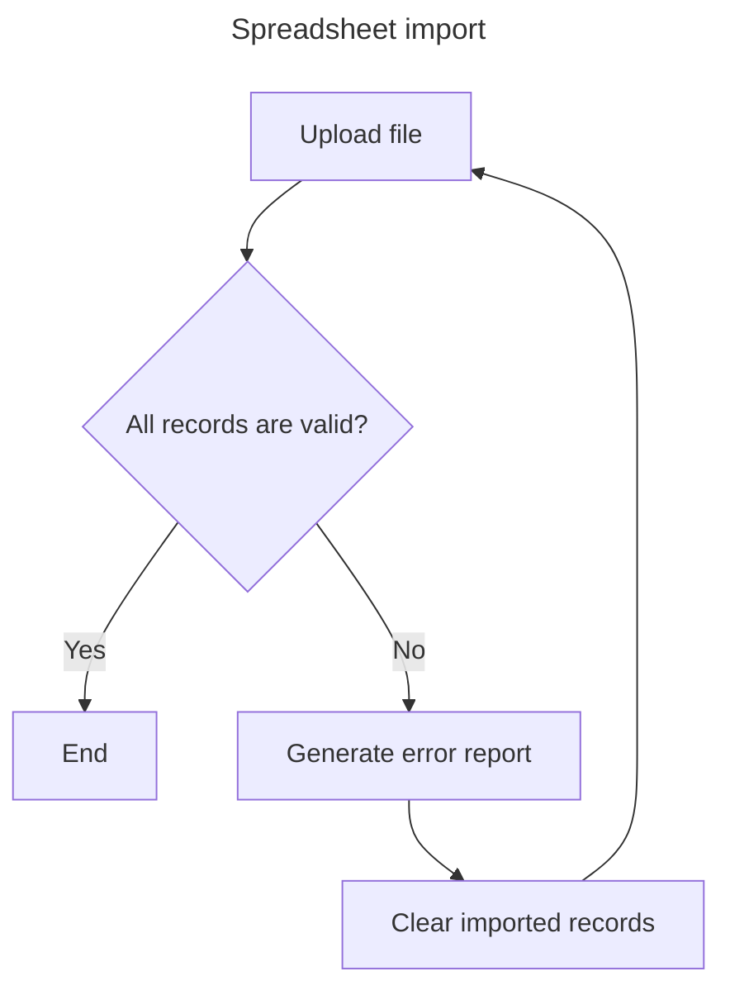
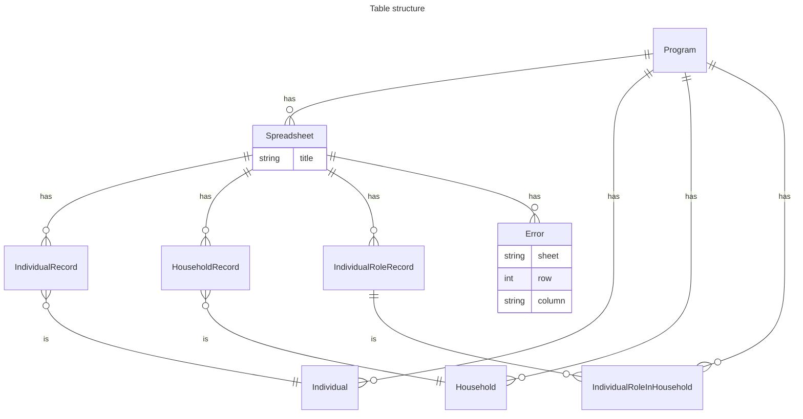
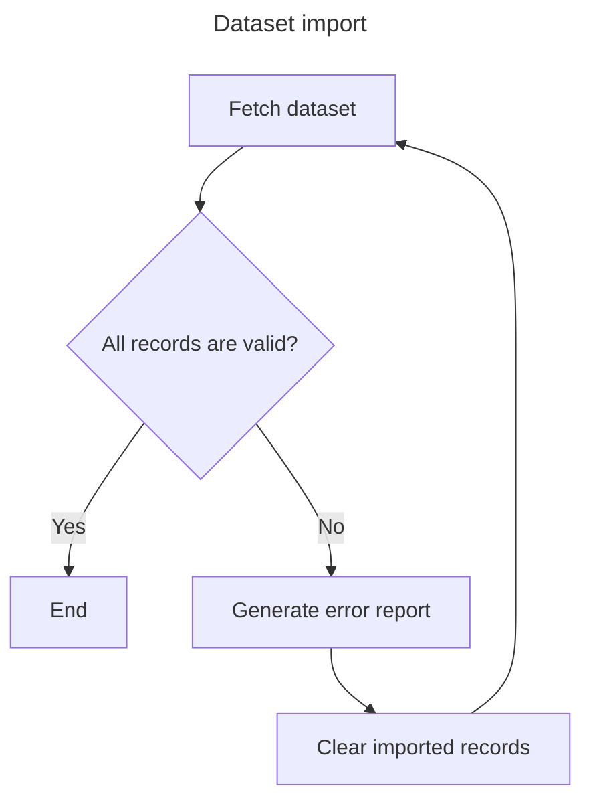
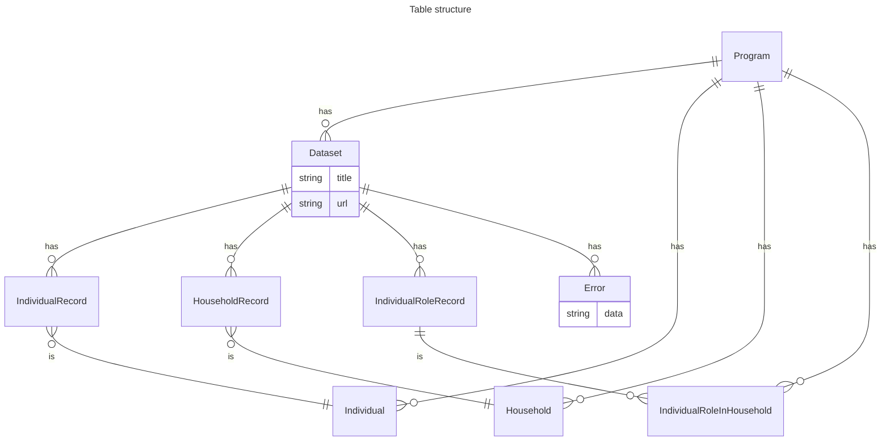

# hope-country-workspace

## Spreadsheet import

Previous import error report could be displayed on spreadsheet entry page.

**TBD**:

- Do we need to save data from previous import attempt if we still have to parse
  each row on every import attempt?
- Should we add a flag to show data from spreadsheet is ready for export to HOPE?
- Do we need to display errors from previous import attempt on spreadsheet entry
  page?

## Kobo Import

**TBD:**
- Dataset format
- Do we need to display errors from previous import attempt on dataset entry page?

## Aurora Import

## HOPE export

**TBD**:

- When deduplication is run in Country Workspace?
