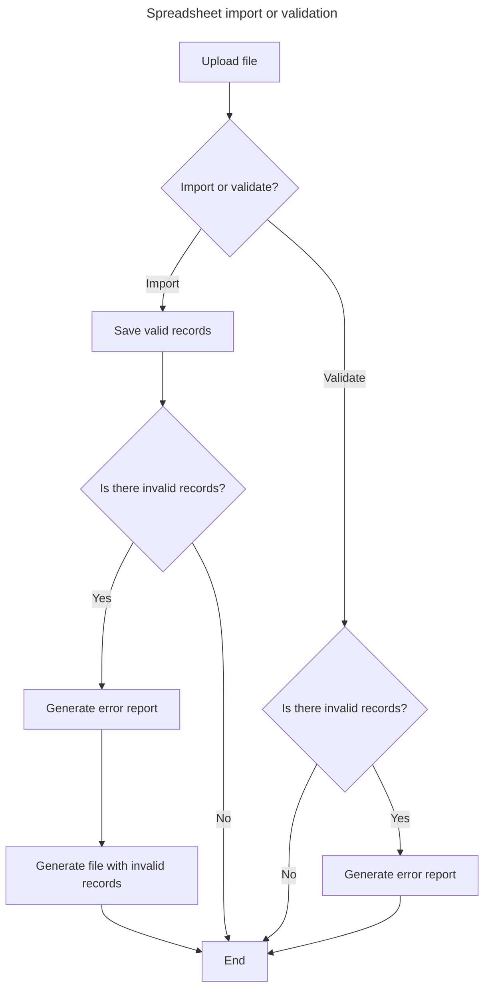
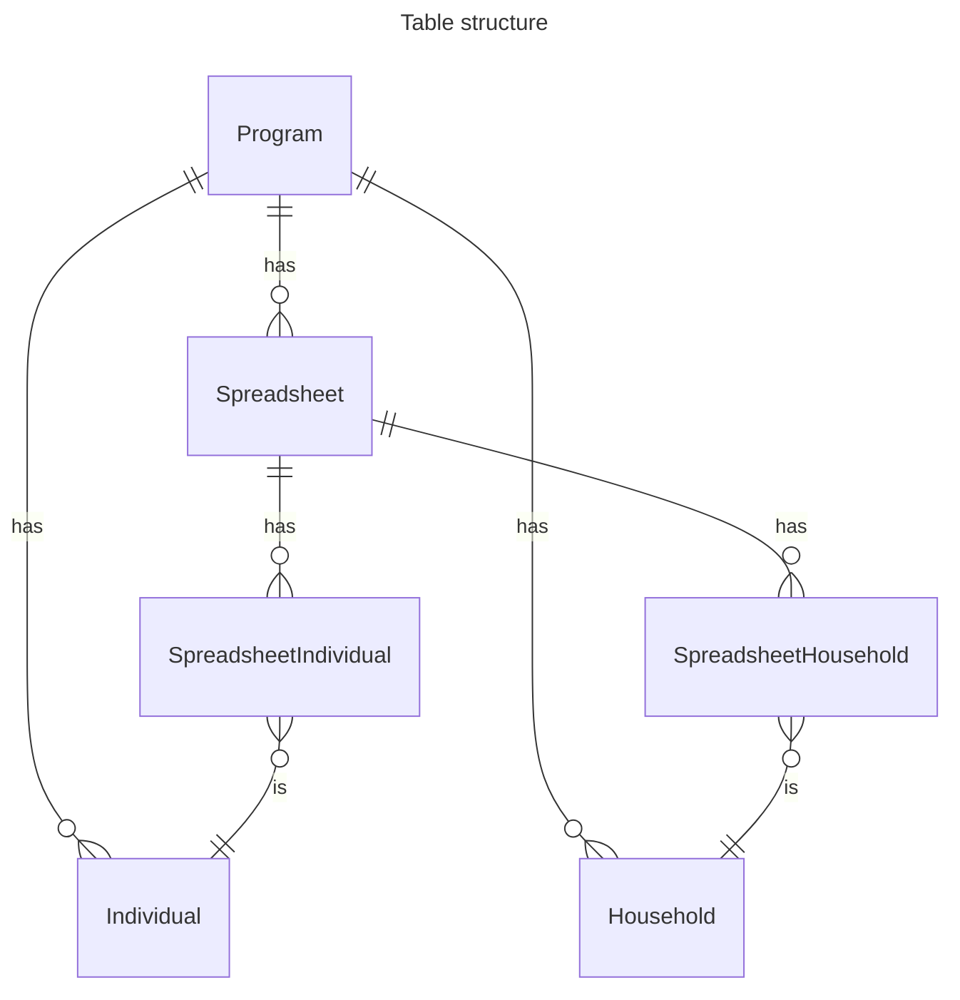
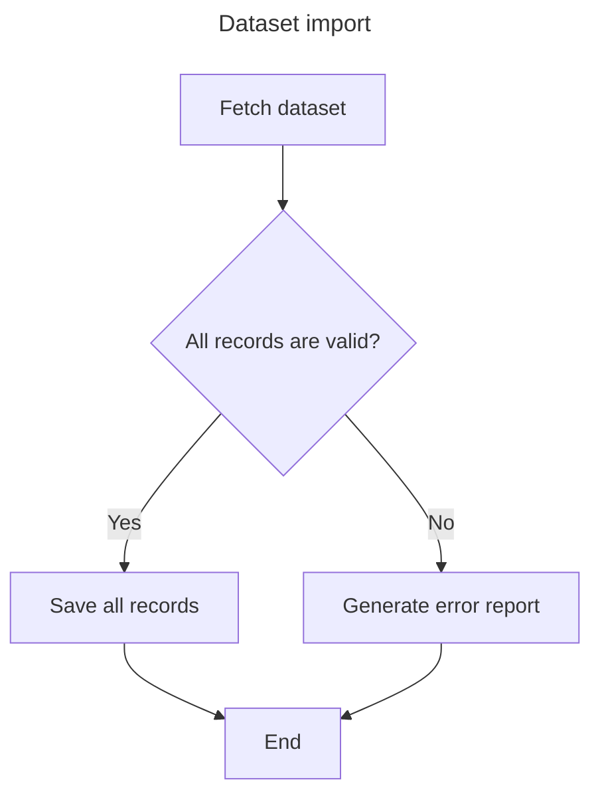
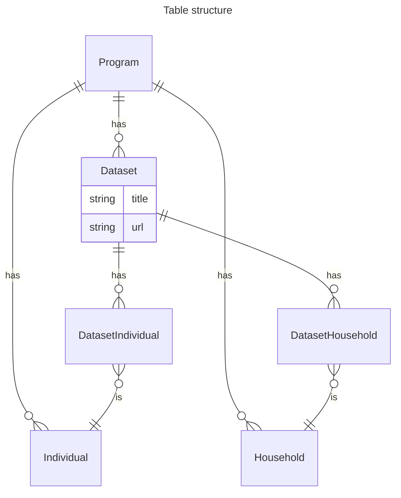

# hope-country-workspace

## Spreadsheet import

**TBD**:
- Previous import error report could be displayed on spreadsheet entry page.
- Do we need to save data from previous import attempt if we still have to parse
  each row on every import attempt?
- Do we need to display errors from previous import attempt on spreadsheet entry
  page?

## Kobo Import

**TBD:**

- Dataset format
- Do we need to display errors from previous import attempt on dataset entry page?

## Aurora Import

## HOPE export

**TBD**:

- When deduplication is run in Country Workspace?
