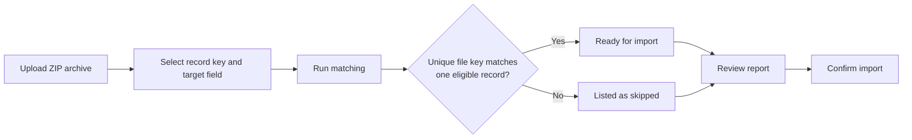

# Batches

A Batch represents one **[data import](index.md)** within the selected Office and **[Program](../program.md)**. It groups any beneficiary records created by the import and records its source, the user who started it, its date, and processing status.

Batches are created automatically during imports from **[RDI](sources/xlsx.md)**, **[Aurora](sources/aurora.md)**, and **[Kobo](sources/kobo.md)**. They cannot be created manually.

## Open and review a Batch

Open **Batches** in the **[Analyst / Collector Workspace](../interfaces.md#analyst--collector-workspace)** after selecting the required Office and Program.

Only Batches belonging to the selected Office and Program are available.

Open a Batch to review its source, status, and imported beneficiary records.

For a household-based Program, the Batch provides separate links to its Households and Individuals. For a people-only Program, it provides a link to its People records. The link names follow the beneficiary labels configured for the **[Program](../program.md)**.

### Batch status

A Batch can have one of the following statuses:

| Status       | Meaning                                                                                      |
| ------------ | -------------------------------------------------------------------------------------------- |
| **Loading**  | The import has started but has not completed its final processing.                           |
| **Complete** | The source-specific import process has completed. |

Validation may continue in background jobs after a Batch becomes **Complete**. Validation results can therefore become available after the import itself has finished.

A Batch can remain in **Loading** when an import fails before final processing or while a source-specific continuation job is running. See the corresponding page under **[Data sources](sources/index.md)** for source-specific behavior.

## Batch actions

Available actions depend on the user's permissions.

## Reprocessing

Reprocessing applies the current Program processing configuration to records already stored in a Batch.

It uses the source data saved with the imported records and does not request or upload the original source again. Changes made in Aurora, Kobo, or the original Excel workbook after the import are therefore not retrieved during reprocessing.

Use reprocessing to:

* apply a new or updated **[Mapping Importer](mapping_transformers.md#mapping-importers)**;
* apply a new or updated **[Transformer](mapping_transformers.md#transformers)**;
* reapply current Program defaults and source-specific processing rules;
* recreate supported relationships between records;
* validate the resulting records again.

Records that have already been pushed to HOPE are excluded from reprocessing.

### Configure reprocessing

Open the required Batch and select **Batch actions** → **Reprocess Batch**. Select any optional Mapping Importers or Transformers, then select **Confirm**.

For a household-based Program, separate options are available for Households and Individuals.

For a people-only Program, the Individual Mapping Importer and Transformer options are applied to People records.

Available Mapping Importers depend on the corresponding Program **[DataChecker](../data_validation/datachecker_configuration.md#datachecker)**. Available Transformers are limited to the Batch's Office.

Reprocessing can also be started without selecting a Mapping Importer or Transformer. In this case, Country Workspace reapplies the source-specific processing and **[validation configuration](../program.md#validation-configuration)** without additional mapping or transformation.

### How records are reprocessed


**Read stored source data** uses the data saved with each record included in reprocessing.

**Apply import processing and mappings** rebuilds beneficiary fields using the rules for the Batch source, current Program defaults, ignored fields, and any selected Mapping Importer.

**Recreate supported relationships** restores the relationships supported by the original import flow for that source.

**Apply Transformers** applies any selected Household or Individual Transformer after the beneficiary fields have been rebuilt.

**Schedule validation** creates background validation jobs for the reprocessed records.

Reprocessing runs as a background job. Review the reprocessing job to confirm whether the Batch was processed successfully. Validation results become available as the separately scheduled validation jobs finish.

## Import pictures

Pictures can be added to Individuals or People in an existing Batch by uploading a ZIP archive.

Pictures are matched using a selected field from the source data saved during the original import. The picture filename, without its extension, must match the value of that field in exactly one eligible record.

Pictures cannot be added to Household records through this action.

### How picture matching works

**Record key field (from raw data)** specifies which source-data field is used for matching.

For example, an imported Individual can have the following stored source data:

```text
individual_id: 1042
national_id_document_number: ID-987654
```

If `individual_id` is selected as **Record key field**, the matching picture must be named:

```text
1042.jpg
```

If `national_id_document_number` is selected instead, the matching picture must be named:

```text
ID-987654.jpg
```

Country Workspace removes the file extension and compares the remaining filename with the selected field value. If exactly one eligible record has that value, the picture is written to the selected **Target image field**, such as `Photo`.

Leading and trailing spaces are ignored, and matching is not case-sensitive. For example, these values are treated as the same key:

Leading and trailing spaces are ignored, and matching is not case-sensitive. Here, `␠` represents a space:

```text
ID-987654
id-987654
␠ID-987654␠
```

### Prepare the ZIP archive

Create a ZIP archive containing the pictures to import.

Each filename without its extension must correspond to the selected source-data field. For example, when matching by `individual_id`:

```text
1.jpg
2.png
1042.jpeg
```

The archive must be a valid ZIP file and must remain within the configured upload size and file-count limits.

Files that cannot be recognized as images are ignored.

### Configure matching

Open the required Batch and select **Batch actions** → **Import pictures**.

Then:

1. Upload the archive in **Pictures ZIP file**.
2. Select the **Record key field (from raw data)** used to match filenames to records.
3. Select the **Target image field** that will receive each matched picture.
4. Select **Run matching**.

Available record key fields are taken from the stored source data of eligible Individuals or People in the Batch.

Available target fields are compatible image or document image fields from the Program's Individual **[DataChecker](../data_validation/datachecker_configuration.md#datachecker)**.

Picture import cannot be started when the Batch has no available source-data keys or the Individual DataChecker has no compatible target field.



### Review the matching report

The report shows successful matches and files that will be skipped because their key:

* is duplicated in the ZIP archive;
* matches multiple records;
* does not match any record.

Files that are not recognized as images are ignored.

Only successful matches are imported. Select **Start over** to upload another archive or change the matching configuration.

### Confirm the import

Select **Confirm import** after reviewing the matching report.

Country Workspace schedules a background job, rechecks the matches, and writes each successfully matched picture to the selected target field.

Validation results are cleared for updated records, but validation is not started automatically. Use **[Batch reprocessing](#reprocessing)** or validate the records when new results are required.

If the matching session expires before confirmation, run the matching step again. The temporary ZIP archive and matching data are removed after the job finishes, including when it fails.

## Remove a Batch

A Batch cannot be deleted from the **[Analyst / Collector Workspace](../interfaces.md#analyst--collector-workspace)**.

Staff users can permanently remove a Batch from **[Staff Administration](../interfaces.md#staff-administration)** by opening the Batch and using the **Batch cleanup** action.

Batch cleanup runs as a background job and deletes:

* the Batch;
* its related Households;
* its related Individuals or People.

This operation cannot be undone.

## Troubleshooting

Review the relevant background job when Batch processing does not complete as expected.

Most problems relate to one of these areas:

* **Import or reprocessing** — the import did not complete, stored source data is missing, selected processing configuration is incompatible, or some records were already pushed to HOPE and excluded.
* **Picture import setup** — no source-data key or compatible target image field is available, or the ZIP archive is invalid or exceeds the configured limits.
* **Picture matching** — filenames do not match the selected source field, a key is duplicated or ambiguous, or the matching session has expired.

For source-specific import problems, see **[Data sources](sources/index.md)**. For general import issues, see **[Troubleshooting](troubleshooting.md)**.
