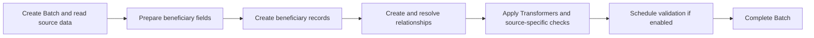

# Data Import

Country Workspace supports importing beneficiary data from multiple sources. Every import runs within the selected **[Program](../program.md)** and creates a **[Batch](batches.md)** that groups the imported records.

This section explains how to prepare a Program, choose and configure a data source, review imported records, reprocess existing Batches, and resolve common import issues.

## Import workflow

## Before you import

Before importing beneficiary data, make sure that the selected **[Program](../program.md)** is configured for the required beneficiary structure and validation rules.

Depending on the selected source, additional preparation may be required. Source-specific requirements and instructions are described in **[Data sources](sources/index.md)**.

Optional field mappings and value transformations are described in **[Mapping and transformation](mapping_transformers.md)**.

## What happens during import

Although each data source has its own preparation and processing rules, all imports follow the same general lifecycle.

**Create Batch and read source data** creates a Batch in **Loading** status and reads records from the uploaded workbook or selected external source.

**Prepare beneficiary fields** applies source-specific preparation, normalizes field names, applies selected **[Mapping Importers](mapping_transformers.md#mapping-importers)**, processes supported document fields, applies Program defaults, and removes ignored fields.

**Create beneficiary records** creates Households and Individuals, or People, according to the Program structure. The source data used to create each record is stored for later **[Batch reprocessing](batches.md#reprocessing)**.

**Create and resolve relationships** creates the Household membership, Household roles, and cross-record references supported by the selected source.

**Apply Transformers and source-specific checks** applies selected **[Transformers](mapping_transformers.md#transformers)** after beneficiary records and supported relationships have been created. Additional checks, such as RDI duplicate identity detection, are performed when configured and supported by the source.

**Schedule validation if enabled** creates background validation jobs using the Program's **[validation configuration](../program.md#validation-configuration)**. Unexpected fields are reported as **[Alien Fields](../data_validation/alien_fields.md)** during validation.

**Complete Batch** marks the Batch as **Complete** after source-specific processing has finished and any enabled validation jobs have been scheduled. Validation results may continue to appear after the Batch becomes Complete.

Source-specific preparation, relationships, checks, and failure behavior are described under **[Data sources](sources/index.md)**.

### Validation after import

**Validate after import** is enabled by default and can be disabled when configuring the import. When enabled, validation is scheduled after all source-specific processing has finished.

## Import results

After source-specific processing finishes, open the created **[Batch](batches.md)** to review the imported records and processing status.

If processing stops before finalization, the Batch can remain **Loading**.

Validation results may continue to appear as background validation jobs finish.

If the Program processing configuration, Mapping Importers, or Transformers change later, the Batch can be reprocessed without requesting or uploading the original source again.

See **[Batches](batches.md)** for Batch review, status, reprocessing, picture import, and cleanup.

## Supported data sources

Country Workspace currently supports importing beneficiary data from:

- **[RDI (Excel file)](sources/xlsx.md)**;
- **[Aurora](sources/aurora.md)**;
- **[Kobo](sources/kobo.md)**.

An overview of the available sources and their requirements is provided in **[Data sources](sources/index.md)**.

## Troubleshooting

If an import cannot be started, does not complete, or produces unexpected records, see **[Troubleshooting](troubleshooting.md)**.
