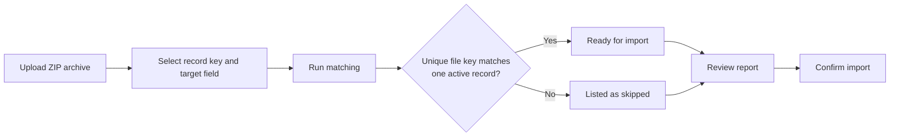

# Import pictures

Pictures can be added to Individuals or People in an existing **[Batch](batches.md)** by uploading a ZIP archive.

Pictures are matched using a selected field from the source data saved during the original import. The picture filename, without its extension, must match the value of that field in exactly one active record.

Pictures cannot be added to Household records through this action.

## How picture matching works

**Record key field (from raw data)** specifies which source-data field is used for matching.

For example, an imported Individual can have the following stored source data:

```text
individual_id: 1042
national_id_document_number: ID-987654
```

If `individual_id` is selected as **Record key field**, the matching picture must be named:

```text
1042.jpg
```

If `national_id_document_number` is selected instead, the matching picture must be named:

```text
ID-987654.jpg
```

Country Workspace removes the file extension and compares the remaining filename with the selected field value. If exactly one active record has that value, the picture is written to the selected **Target image field**, such as `Photo`.

Leading and trailing spaces are ignored, and matching is not case-sensitive. Here, `␠` represents a space:

```text
ID-987654
id-987654
␠ID-987654␠
```

## Prepare the ZIP archive

Create a ZIP archive containing the pictures to import.

Each filename without its extension must correspond to the selected source-data field. For example, when matching by `individual_id`:

```text
1.jpg
2.png
300.png
1042.jpeg
```

The archive must be a valid ZIP file and must remain within the configured upload size and file-count limits.

Files that cannot be recognized as images are ignored.

## Configure matching

Open the required Batch, open **Batch actions**, and select **Import pictures**.

Then:

1. Upload the archive in **Pictures ZIP file**.
2. Select the **Record key field (from raw data)** used to match filenames to records.
3. Select the **Target image field** that will receive each matched picture.
4. Select **Run matching**.

Available record key fields are collected from the stored source data of active Individuals or People in the Batch.

Available target fields are compatible image or document image fields from the Program's Individual **[DataChecker](../data_validation/datachecker_configuration.md#datachecker)**.

Picture import cannot be started when the Batch has no available source-data keys or the Individual DataChecker has no compatible target field.



## Review the matching report

The report shows:

* the number of recognized image files;
* the number of active Individuals or People in the Batch;
* the number of successful matches;
* duplicate filename keys;
* keys that match multiple records;
* files with no matching record.

Files that are not recognized as images are ignored.

Only successful matches are imported. Select **Start over** to upload another archive or change the matching configuration.

## Confirm the import

Select **Confirm import** after reviewing the matching report.

Country Workspace schedules a background job, rechecks the matches, and writes each successfully matched picture to the selected target field.

Validation results are cleared for updated records, but validation is not started automatically. Validate the affected records separately when new results are required.

Batch reprocessing rebuilds beneficiary fields from the stored source data and does not preserve pictures added through **Import pictures**. After reprocessing, import the pictures again.

If the matching session expires before confirmation, run the matching step again. The temporary ZIP archive and matching data are removed after the job finishes, including when it fails.

## Troubleshooting

Most picture import problems relate to one of these areas:

* **Setup**: no source-data key or compatible target image field is available, or the ZIP archive is invalid or exceeds the configured limits.
* **Matching**: filenames do not match the selected source field, a key is duplicated or ambiguous, or no matching record exists.
* **Confirmation**: the matching session expired before confirmation or the background job did not complete successfully.

Review the related background job when confirmed pictures are not imported.
