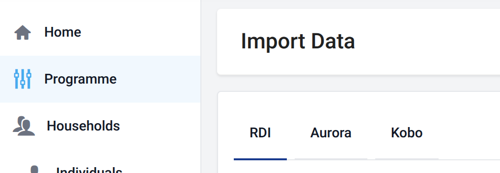

# Data Sources

Country Workspace supports importing beneficiary data from several sources. Each import runs within the selected **[Program](../../program.md)** and creates a **[Batch](../batches.md)** containing the imported records.

The general process is described in **[Data Import](../index.md)**. This section explains how the available sources differ and how to configure each one.

## Choosing a data source

Open **Import Data**, then select the tab for the source where the beneficiary data is maintained.

Country Workspace currently supports:

- **[RDI (Excel file)](xlsx.md)** — imports data from an Excel workbook;
- **[Aurora](aurora.md)** — imports beneficiary registrations from Aurora;
- **[Kobo](kobo.md)** — imports beneficiary registrations from a Kobo project.

Each source has its own requirements and configuration options, described on its source-specific page.
