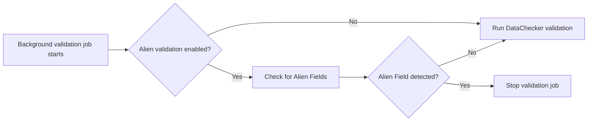

# Alien Fields

An **Alien Field** is a processed beneficiary field that is not defined in the **[DataChecker](datachecker_configuration.md#datachecker)** used for that record.

Household records use the Household DataChecker, while Individual and People records use the Individual DataChecker.

## How Alien Fields are detected

Alien Fields are detected during validation, not while records are imported.

The **Validate after import** option is available on each source tab of the Program's **Import Data** page and is enabled by default. When selected, Country Workspace schedules background validation jobs after import processing has finished. The Program setting **Alien validation enabled** determines whether those jobs include the Alien Field check.



Alien Fields are identified from the processed fields of a record. These fields may already have been changed by a **[Mapping Importer](../data_import/mapping_transformers.md#mapping-importers)** or **[Transformer](../data_import/mapping_transformers.md#transformers)**.

### Fast-fail behavior

Background validation checks only the first record in each validation chunk for Alien Fields.

If Alien Fields are detected, the current validation job stops, and no further records assigned to that job are validated.

For a Household, the check reports all Alien Fields found on the Household and on the first affected member. It does not inspect the remaining members after that point or provide a complete report for other records.

When **Alien validation enabled** is on, single-record validation performs the same check before regular DataChecker validation.

## Fields to ignore

Fields in the ignore list are excluded from Alien Field validation.

For a household-based Program, configure separate ignore lists for Household and Individual records. For a people-only Program, the Individual ignore list applies to People records.

During import and reprocessing, matching fields are removed before Transformers are applied. If a Transformer recreates an ignored field, the field remains excluded from Alien Field validation but is stored in the beneficiary data.

Use the field name present in the processed record. If a Mapping Importer renames the field, use its mapped target name.

### Configure fields to ignore

1. Open the required Program.
2. Select **Configure Alien Fields to Ignore** for the required record type.
3. Add fields that should be discarded, or remove fields that should no longer be ignored.
4. Save the configuration.

Changing the ignore list affects subsequent Alien Field validation immediately. Reprocess the Batch only when the matching fields must also be removed from the stored beneficiary data.

## Resolve Alien Fields

Choose the resolution according to the purpose of the field:

* add the field to the corresponding DataChecker when it is valid beneficiary data;
* use a Mapping Importer when the source field has the correct value but the wrong name;
* update the Transformer when it creates an unsupported field;
* add the field to the ignore list when it is not required and should be discarded.

After changing a Mapping Importer or Transformer, **[reprocess the Batch](../data_import/batches.md#reprocessing)** and review the new validation job.

After changing the DataChecker or ignore list, run validation again. Reprocess the Batch only if the stored beneficiary fields must also be rebuilt.

## Example

Assume an Individual record contains:

```text
given_name: John
family_name: Doe
survey_note: Reviewed
```

If the Individual DataChecker defines `given_name` and `family_name` but does not define `survey_note`, then `survey_note` is an Alien Field.
