# DataChecker configuration

DataChecker configuration is used to validate beneficiary data in CW.

## DataChecker context

It defines which beneficiary fields are expected, how they are grouped, and which validation rules should be applied. DataChecker is configured on the [Program](../data_import/program.md#program-in-country-workspace) and used to validate households and individuals.

DataChecker fields must fully match the beneficiary data structure expected by HOPE Core. HOPE Core is the source of truth for field names, required fields, field types, and validation expectations.

## Required HOPE Core fields

If a field is required by HOPE Core, the corresponding DataChecker field must be marked as required.

For a [Flex Field](#flex-field), make sure the final field attributes contain:

```json
{
  "required": true
}
```

This can be configured on the [Field Definition](#field-definition) when the field is always required, or in the **Flex Field Overrides › Attrs** when the field should be required only in this specific configuration.

Use **Inspect** on the [DataChecker](#datachecker) to check the final field attributes before assigning the DataChecker to a [Program](../data_import/program.md#program-in-country-workspace).


## Where to find it

DataChecker configuration is managed in the Django admin under **Home › Flex Fields**.

This section contains:

- **DataCheckers** — final validation configurations assigned to Programs;
- **Field Definitions** — reusable field types;
- **Fieldsets** — reusable groups of fields;
- **Flex Fields** — technical beneficiary fields used in validation and imports.

## When DataChecker is used

DataChecker can be used when:

- beneficiary data is imported or validated after import;
- a beneficiary is edited in the admin form;
- a single beneficiary is validated manually;
- the whole Program is validated.

## Main concepts

### Field Definition

A Field Definition describes a reusable field type used by [Flex Fields](#flex-field).

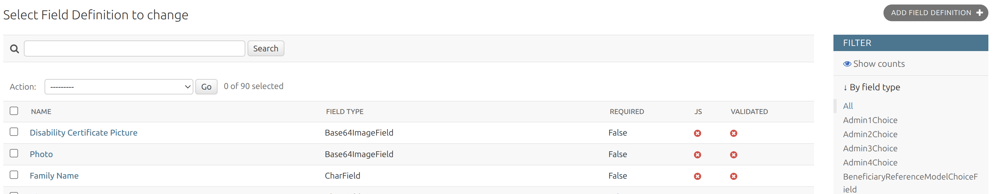

#### Creating a Field Definition

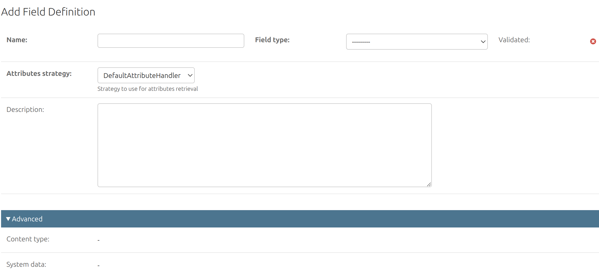

To create a new Field Definition:

1. Open **Field Definitions**, click **Add Field Definition**.
2. Fill in **Name**, select **Field type**, add **Description** if needed.
3. Save the record.

#### Changing a Field Definition

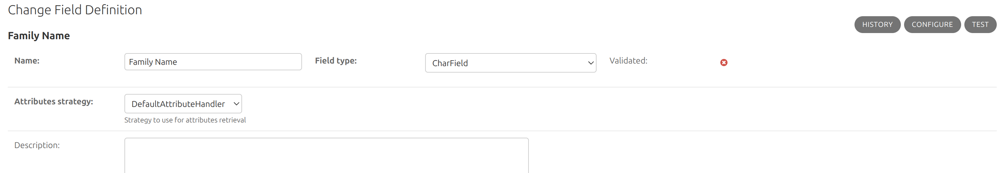

On the Field Definition change page, use:

- **Configure** to edit attributes for the selected field type;
- **Test** to open a simple form and check how the field behaves with real input.

Field attributes depend on the selected field type. Some attributes are common, such as `required` or `help_text`; others are type-specific, for example `max_length`, `min_length`, `allow_empty_file`, etc.

### Flex Field

A Flex Field is the actual field used in beneficiary data. It links a technical field name with a [Field Definition](#field-definition) and a [Fieldset](#fieldset).

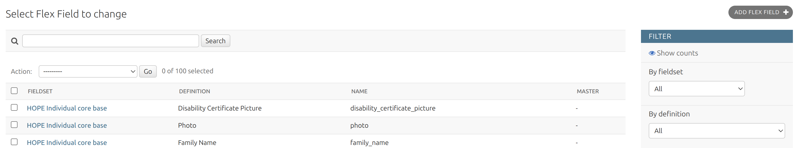

The field name is used in imports, validation, and beneficiary data.

#### Creating a Flex Field

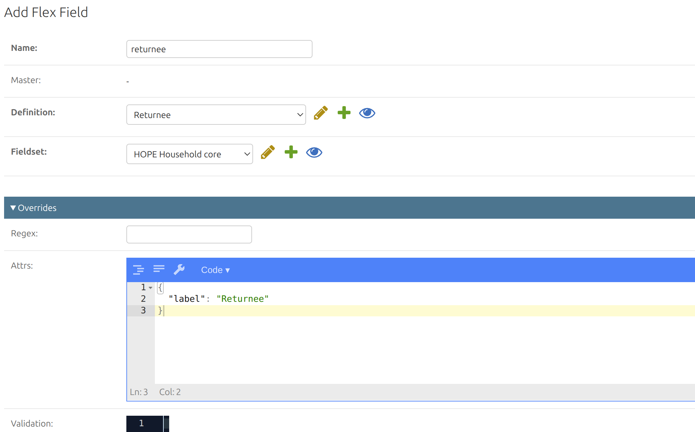

To create a new Flex Field:

1. Open **Flex Fields**, click **Add Flex Field**.
2. Fill in **Name** using the field name expected by HOPE Core.
3. Select **Definition** and **Fieldset**.
4. Set **Master** only for dependent fields, when available values depend on another field in the same Fieldset.
5. Use **Overrides** only if the selected [Field Definition](#field-definition) needs to be adjusted for this specific field:
   - **Regex** to replace the default regex validation;
   - **Attrs** to override or extend field attributes;
   - **Validation** to replace the default JavaScript validation.
6. Save the record.

#### Changing a Flex Field

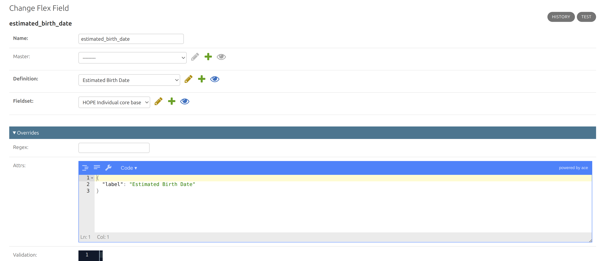

On the Flex Field change page, use **Test** to open a simple form and check how the field behaves with real input.

Do not change **Name** after data has already been imported unless the same change is also expected by HOPE Core.

### Fieldset

A Fieldset is a group of [Flex Fields](#flex-field) that can be reused in a [DataChecker](#datachecker).

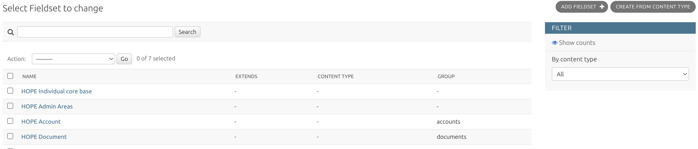

#### Creating a Fieldset

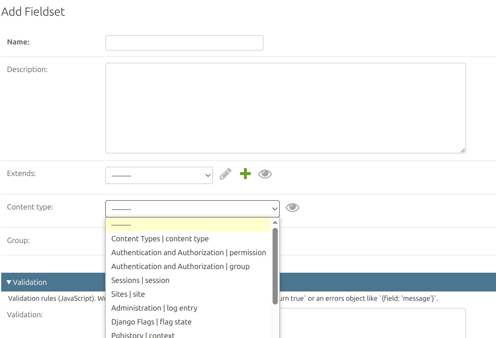

To create a Fieldset manually:

1. Open **Fieldsets**, click **Add Fieldset**.
2. Fill in **Name** and **Description** if needed.
3. Set **Extends** only if this Fieldset should reuse fields from another Fieldset.
4. Set **Content type** only if this Fieldset is based on a Django model.
5. Set [**Group**](#group) if fields should be grouped in the generated beneficiary data.
6. Add [**Validation**](#validation) only if cross-field validation is needed.
7. Save the record.

You can also use **Create from Content Type** to generate a Fieldset from an existing Django model form.

#### Changing a Fieldset

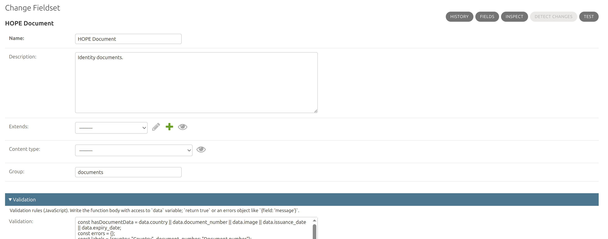

On the Fieldset change page, use:

- [**Fields**](#fields) to add, edit, or delete [Flex Fields](#flex-field) in this Fieldset;
- **Inspect** to review the generated field structure and final field attributes;
- **Test** to open a generated form with all fields from this Fieldset and validate sample input before using the Fieldset in a [DataChecker](#datachecker);
- **Detect changes** to compare the Fieldset with its Content Type, when Content Type is configured.

#### Fields

Use **Fields** to manage [Flex Fields](#flex-field) inside the Fieldset.

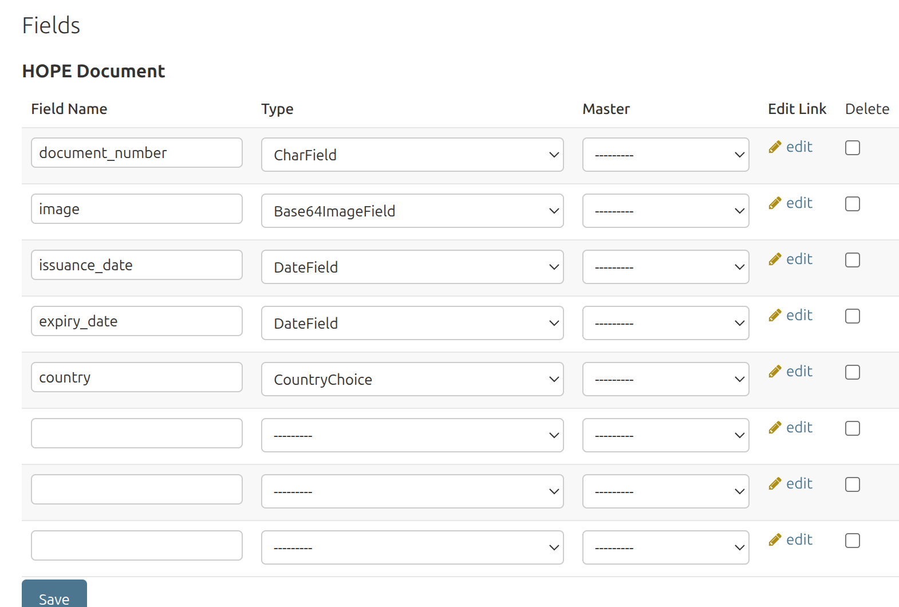

Each row defines the field name, field type, optional Master field, edit link, and delete flag.

#### Group

Use **Group** when fields from this Fieldset should be grouped in the generated beneficiary data. For example, the `HOPE Document` Fieldset uses the `documents` group.

Leave **Group** empty for root-level fields.

#### Validation

Fieldset validation is used for cross-field checks. Validation rules are written in JavaScript and have access to the `data` variable.

Return `true` when the data is valid, or return an errors object when validation fails.

Example: makes `country` and `document_number` required when any document data is provided.

```javascript
const hasDocumentData = data.country || data.document_number || data.image || data.issuance_date || data.expiry_date;
const errors = {};
const labels = {country: "Country", document_number: "Document number"};

if (hasDocumentData) {
  for (const field of ["country", "document_number"]) {
    if (!data[field]) {
      errors[field] = `${labels[field]} is required when document data is provided.`;
    }
  }
}

return Object.keys(errors).length ? errors : true;
```

Use field names from the Fieldset, not display labels.

### DataChecker

A DataChecker is the final validation configuration used by a Program. It combines one or more [Fieldsets](#fieldset).

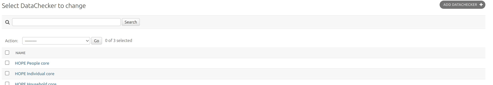

#### Creating a DataChecker

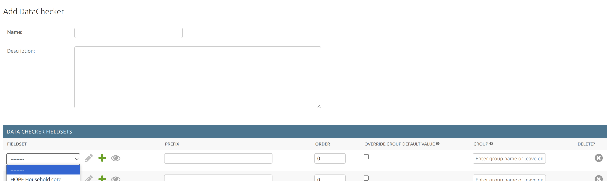

To create a new DataChecker:

1. Open **DataCheckers**, click **Add DataChecker**.
2. Fill in **Name** and **Description** if needed.
3. Add the required Fieldsets in **Data Checker Fieldsets**.
4. Set [**Prefix**](#prefixes) only when field names should be namespaced.
5. Set **Order** to arrange [Fieldsets](#fieldsets) in this [DataChecker](#datachecker) configuration.
6. Use [**Override group default value**](#groups) only when the Fieldset group should be replaced.
7. Save the record.

Field names inside one DataChecker must be unique. Only one Identity Field is allowed per DataChecker.

#### Prefixes

**Prefix** changes field names from the selected [Fieldset](#fieldset) inside this DataChecker.

If the Fieldset has a field `number`:

| Prefix | Resulting field name |
|---|---|
| empty | `number` |
| `national_id_` | `national_id_number` |
| `national_id_%s` | `national_id_number` |
| `%s_national_id` | `number_national_id` |

Use a simple prefix like `national_id_` when the field name should only be prefixed. Use `%s` only when the original field name must be inserted into a custom position.

Use Prefix only when fields from this Fieldset must be namespaced or when the same Fieldset is used more than once in one DataChecker.

#### Groups

**Group** defines where Fieldset data appears in the generated beneficiary structure.

Example: the `HOPE Document` Fieldset has the default group `documents`.

If this Fieldset contains `document_number`, the generated structure is:

```json
{
  "documents": {
    "document_number": "ABC123"
  }
}
```

Use **Override group default value** when this DataChecker needs different grouping for the same Fieldset.

| Override group default value | Group | Result |
|---|---|---|
| unchecked | ignored | Use Fieldset default group: `documents` |
| checked | `identity_documents` | Use custom group: `identity_documents` |
| checked | empty | Put fields at root level |

Root-level result:

```json
{
  "document_number": "ABC123"
}
```

#### Changing a DataChecker

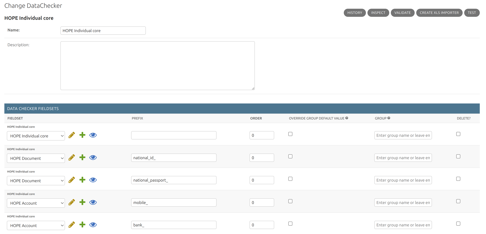

On the DataChecker change page, use:

- **Inspect** to review the generated field structure and final field attributes;
- **Validate** to upload a sample import file and check how its rows are validated;
- **Create XLS importer** to download an XLSX import template generated from the DataChecker fields;
- **Test** to open a generated form with all fields from this DataChecker and validate sample input.

## How-to guides

For a step-by-step example, see [Create a multiple choice field](howto/create-multiple-choice-field.md).

## Recommended workflow

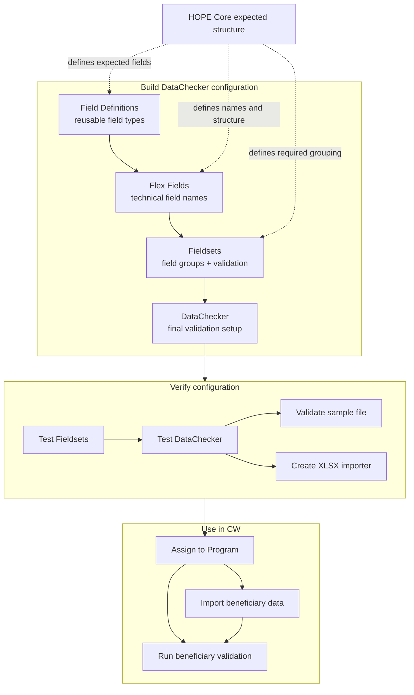

## Best practices

- Reuse existing [Field Definitions](#field-definitions) and keep [Fieldsets](#fieldsets) focused.
- Keep technical field names stable after data has already been imported.
- Use [prefixes](#prefixes) and [groups](#groups) only when the beneficiary data structure requires them.
- Use Fieldset [validation](#validation) only for cross-field checks.
- Test the configuration with sample data before assigning it to a Program or using it in production.
