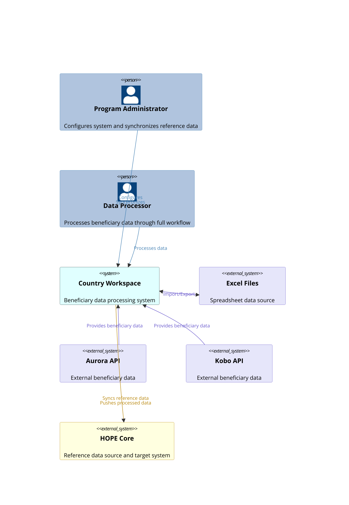

# System Context Diagram

This diagram provides a high-level view of the *Country Workspace* system in its broader environment.
It highlights key external actors and systems interacting with Country Workspace:

- `Program Administrator`: configures the system and synchronizes reference data
- `Data Processor`: processes beneficiary data through the workflow
- External systems providing data: `Aurora API`, `Kobo API`, `Excel Files`
- External target system: `HOPE Core`

Country Workspace synchronizes reference data from HOPE Core, ingests data from various external sources, and exports processed data back to HOPE Core.
Relationships are styled to reflect the origin system for clarity.

