# Container Diagram

This diagram describes the container-level architecture. It illustrates the core services and their interactions for data processing:

- `Web Application`: UI for administrators and data processors
- `Sync Service`: admin-initiated loading of reference data from HOPE Core
- `Import Processor`: imports data from Excel files and external APIs (Aurora, Kobo)
- `Validation Engine`: validates data using configurable datacheckers (can be triggered independently or during import)
- `Transformation Engine`: performs bulk updates, regex transformations, and data modifications
- `Serialization Engine`: transforms data using custom serializers to prepare for export
- `Push Service`: sends processed data to HOPE Core
- `Database` and `Task Queue`: store data and manage background processing jobs

The system supports multiple data processing workflows:

- **Import flow**: Import → Validation → Serialization → Push
- **Independent operations**: Validation, Transformation and Push can be triggered directly by users
- **Reference data sync**: Admin-initiated synchronization with HOPE Core

Relationships are styled with colors matching their source services for clarity, with no text labels to maintain visual simplicity.

```mermaid

C4Container

    Person(admin, "Program Administrator", "Configures system and synchronizes reference data")
    Person(processor, "Data Processor", "Processes beneficiary data through full workflow")

    System_Ext(hope_core, "HOPE Core", "Reference data source and target system")
    System_Ext(xlsx_files, "Excel Files", "Spreadsheet data source")
    System_Ext(aurora_api, "Aurora API", "External beneficiary data")
    System_Ext(kobo_api, "Kobo API", "External beneficiary data")

    Container_Boundary(cw_boundary, "Country Workspace") {
        Container(web_app, "Web Application", "Django/Tailwind", "Provides UI for configuration and data processing")
        Container(sync_service, "Sync Service", "requests", "Loads reference data from HOPE Core on admin request")
        Container(import_processor, "Import Processor", "Python/Celery", "Processes data imports from external sources")
        Container(validation_engine, "Validation Engine", "Python", "Validates data using datacheckers")
        Container(transformation_engine, "Transformation Engine", "Python/Celery", "Bulk updates, regex transformations, data modifications")
        Container(serialization_engine, "Serialization Engine", "Python/JavaScript", "Transforms data using custom serializers")
        Container(push_service, "Push Service", "requests", "Pushes processed data to HOPE Core")
        ContainerDb(database, "Database", "PostgreSQL", "Stores all system data and configurations")
        Container(task_queue, "Task Queue", "Redis/Celery", "Manages background processing tasks")
    }

    Rel(admin, web_app, "", "HTTPS")
    UpdateRelStyle(admin, web_app, $textColor="steelblue", $lineColor="steelblue", $offsetX="-30", $offsetY="-250")

    Rel(processor, web_app, "", "HTTPS")
    UpdateRelStyle(processor, web_app, $textColor="steelblue", $lineColor="steelblue", $offsetX="120", $offsetY="-250")

    Rel(admin, sync_service, "", "HTTPS")
    UpdateRelStyle(admin, sync_service, $textColor="steelblue", $lineColor="steelblue", $offsetX="-110", $offsetY="-80")

    Rel(web_app, database, "", "SQL")
    UpdateRelStyle(web_app, database, $textColor="blue", $lineColor="blue", $offsetX="-30", $offsetY="0")

    Rel(web_app, import_processor, "", "")
    UpdateRelStyle(web_app, import_processor, $textColor="blue", $lineColor="blue", $offsetX="-30", $offsetY="0")

    Rel(web_app, transformation_engine, "", "")
    UpdateRelStyle(web_app, transformation_engine, $textColor="blue", $lineColor="blue", $offsetX="-10", $offsetY="80")

    Rel(web_app, validation_engine, "", "")
    UpdateRelStyle(web_app, validation_engine, $textColor="blue", $lineColor="blue", $offsetX="0", $offsetY="-10")

    Rel(web_app, push_service, "", "")
    UpdateRelStyle(web_app, push_service, $textColor="blue", $lineColor="blue", $offsetX="0", $offsetY="-10")

    Rel(import_processor, validation_engine, "", "")
    UpdateRelStyle(import_processor, validation_engine, $textColor="darkorange", $lineColor="darkorange", $offsetX="-30", $offsetY="-10")

    Rel(validation_engine, serialization_engine, "", "")
    UpdateRelStyle(validation_engine, serialization_engine, $textColor="purple", $lineColor="purple", $offsetX="-20", $offsetY="10")

    Rel(import_processor, database, "", "SQL")
    UpdateRelStyle(import_processor, database, $textColor="darkorange", $lineColor="darkorange", $offsetX="-120", $offsetY="-150")

    Rel(validation_engine, database, "", "SQL")
    UpdateRelStyle(validation_engine, database, $textColor="purple", $lineColor="purple", $offsetX="-10", $offsetY="-130")

    Rel(transformation_engine, database, "", "SQL")
    UpdateRelStyle(transformation_engine, database, $textColor="darkorchid", $lineColor="darkorchid", $offsetX="0", $offsetY="0")

    Rel(serialization_engine, database, "", "SQL")
    UpdateRelStyle(serialization_engine, database, $textColor="purple", $lineColor="purple", $offsetX="0", $offsetY="-30")

    Rel(import_processor, task_queue, "", "async")
    UpdateRelStyle(import_processor, task_queue, $textColor="darkorange", $lineColor="darkorange", $offsetX="-30", $offsetY="200")

    Rel(transformation_engine, task_queue, "", "async")
    UpdateRelStyle(transformation_engine, task_queue, $textColor="darkorchid", $lineColor="darkorchid", $offsetX="0", $offsetY="-100")

    Rel(sync_service, hope_core, "", "REST/JSON")
    UpdateRelStyle(sync_service, hope_core, $textColor="darkgreen", $lineColor="darkgreen", $offsetX="100", $offsetY="120")

    Rel(sync_service, database, "", "SQL")
    UpdateRelStyle(sync_service, database, $textColor="darkgreen", $lineColor="darkgreen", $offsetX="30", $offsetY="-220")

    Rel(sync_service, task_queue, "", "async")
    UpdateRelStyle(sync_service, task_queue, $textColor="darkgreen", $lineColor="darkgreen", $offsetX="170", $offsetY="-300")

    Rel(import_processor, xlsx_files, "", "File I/O")
    UpdateRelStyle(import_processor, xlsx_files, $textColor="darkorange", $lineColor="darkorange", $offsetX="50", $offsetY="-250")

    Rel(import_processor, aurora_api, "", "REST/JSON")
    UpdateRelStyle(import_processor, aurora_api, $textColor="darkorange", $lineColor="darkorange", $offsetX="-70", $offsetY="-180")

    Rel(import_processor, kobo_api, "", "REST/JSON")
    UpdateRelStyle(import_processor, kobo_api, $textColor="darkorange", $lineColor="darkorange", $offsetX="30", $offsetY="-150")

    Rel(push_service, hope_core, "", "REST/JSON1")
    UpdateRelStyle(push_service, hope_core, $textColor="darkgreen", $lineColor="darkgreen", $offsetX="-50", $offsetY="450")

    Rel(push_service, task_queue, "", "async")
    UpdateRelStyle(push_service, task_queue, $textColor="darkgreen", $lineColor="darkgreen", $offsetX="-10", $offsetY="-50")

    UpdateElementStyle(admin, $bgColor="lightsteelblue", $fontColor="black", $borderColor="steelblue")
    UpdateElementStyle(processor, $bgColor="lightsteelblue", $fontColor="black", $borderColor="steelblue")
    UpdateElementStyle(hope_core, $bgColor="lightyellow", $fontColor="black", $borderColor="darkgoldenrod")
    UpdateElementStyle(xlsx_files, $bgColor="lavender", $fontColor="black", $borderColor="slateblue")
    UpdateElementStyle(aurora_api, $bgColor="lavender", $fontColor="black", $borderColor="slateblue")
    UpdateElementStyle(kobo_api, $bgColor="lavender", $fontColor="black", $borderColor="slateblue")

    UpdateElementStyle(web_app, $bgColor="lightblue", $fontColor="black", $borderColor="blue")

    UpdateElementStyle(sync_service, $bgColor="lightgreen", $fontColor="black", $borderColor="darkgreen")
    UpdateElementStyle(push_service, $bgColor="lightgreen", $fontColor="black", $borderColor="darkgreen")

    UpdateElementStyle(import_processor, $bgColor="peachpuff", $fontColor="black", $borderColor="darkorange")
    UpdateElementStyle(validation_engine, $bgColor="thistle", $fontColor="black", $borderColor="mediumslateblue")
    UpdateElementStyle(serialization_engine, $bgColor="plum", $fontColor="black", $borderColor="darkslateblue")
    UpdateElementStyle(transformation_engine, $bgColor="orchid", $fontColor="black", $borderColor="darkorchid")

    UpdateElementStyle(database, $bgColor="lightgray", $fontColor="black", $borderColor="gray")
    UpdateElementStyle(task_queue, $bgColor="lightgray", $fontColor="black", $borderColor="gray")

    UpdateLayoutConfig($c4ShapeInRow="2", $c4BoundaryInRow="1")

```

