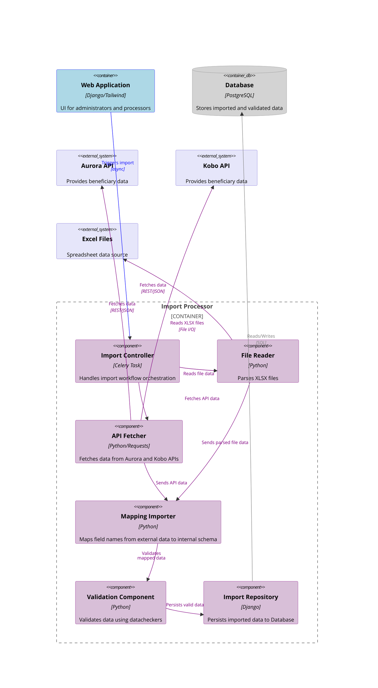

# Component diagram

## Import Processor

This diagram shows the internal component structure of the *Import Processor* container and its interactions with external systems.

**Core Components:**

- `Import Controller`: Orchestrates the import workflow as a Celery task
- `File Reader`: Parses XLSX files from the file system
- `API Fetcher`: Retrieves data from Aurora and Kobo REST APIs
- `Mapping Importer`: Maps external field names to internal schema
- `Validation Component`: Validates data using configurable datacheckers
- `Import Repository`: Persists validated data to the database

**Data Flow:**

1. Web Application triggers import via Import Controller
2. Controller initiates parallel data collection (File Reader for XLSX, API Fetcher for external APIs)
3. Raw data flows through Mapping Importer for schema transformation
4. Validation Component applies datacheckers to mapped data
5. Import Repository persists valid data to Database

**External Dependencies:**

- Excel Files, Aurora API, and Kobo API serve as data sources
- Database stores the processed results

