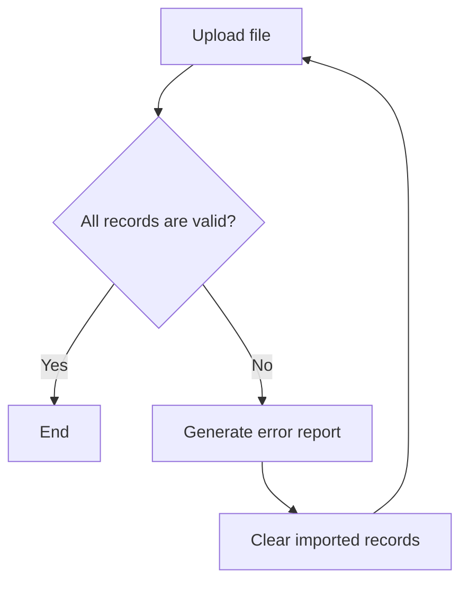

# Import flows

## Spreadsheet import

Previous import error report could be displayed on spreadsheet entry page.

**TBD**:

- Do we need to save data from previous import attempt if we still have to parse
  each row on every import attempt?
- Should we add a flag to show data from spreadsheet is ready for export to HOPE?
- Do we need to display errors from previous import attempt on spreadsheet entry
  page?
