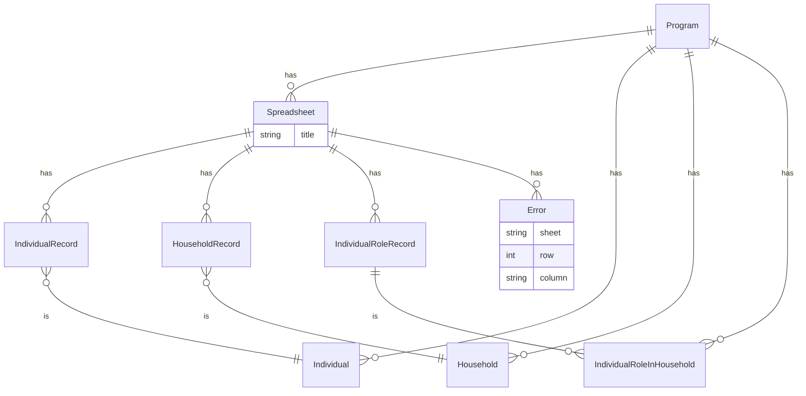

# Data model

```mermaid

erDiagram
    Spreadsheet {
        string title
    }
    
    Error {
        string sheet
        int row
        string column
    }
    
    Program ||--o{ Spreadsheet: has
    Program ||--o{ Individual: has
    Program ||--o{ Household: has
    Program ||--o{ IndividualRoleInHousehold: has

    Spreadsheet ||--o{ IndividualRecord: has
    IndividualRecord }o--|| Individual: is
    Spreadsheet ||--o{ HouseholdRecord: has
    HouseholdRecord }o--|| Household: is
    Spreadsheet ||--o{ IndividualRoleRecord: has
    IndividualRoleRecord ||--o{ IndividualRoleInHousehold: is
    Spreadsheet ||--o{ Error: has
```
