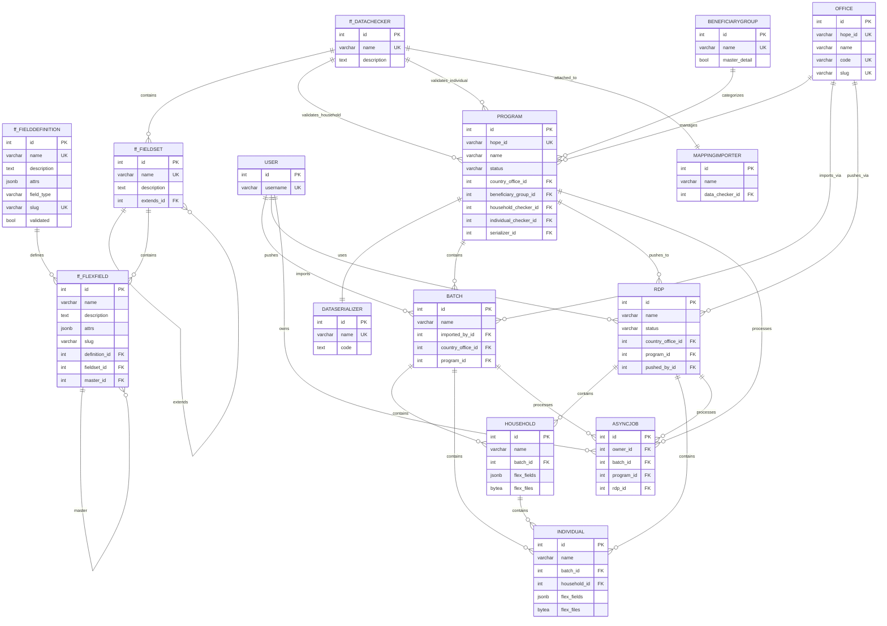

# Data Model

This diagram represents the core data model for the Country Workspace system, which manages beneficiary data import, processing, and export to HOPE Core.

**Key Components:**

**Flex Fields System (ff_*)** - Configurable field definitions and validation rules:

- `ff_DATACHECKER` - Validation rules for data quality
- `ff_FIELDSET` - Groups of related fields
- `ff_FLEXFIELD` - Individual flexible field definitions
- `ff_FIELDDEFINITION` - Field type definitions and constraints

**Core Entities** - Main business objects:

- `OFFICE` - Organizational units managing programs
- `PROGRAM` - Aid programs with specific beneficiary groups
- `BATCH` - Import containers for beneficiary data
- `HOUSEHOLD` / `INDIVIDUAL` - Core beneficiary records with flexible fields
- `RDP` - Export containers for pushing data to HOPE
- `DATASERIALIZER` - Serialization logic for data transformation
- `MAPPINGIMPORTER` - Contains mapping rules applied during data import
- `ASYNCJOB` - Background job processing for system operations

The system supports flexible data schemas through the ff_* entities, allowing different programs to define custom fields and validation rules for their specific beneficiary data requirements. Import processing is handled through configurable mapping rules that transform incoming data to match program requirements.

