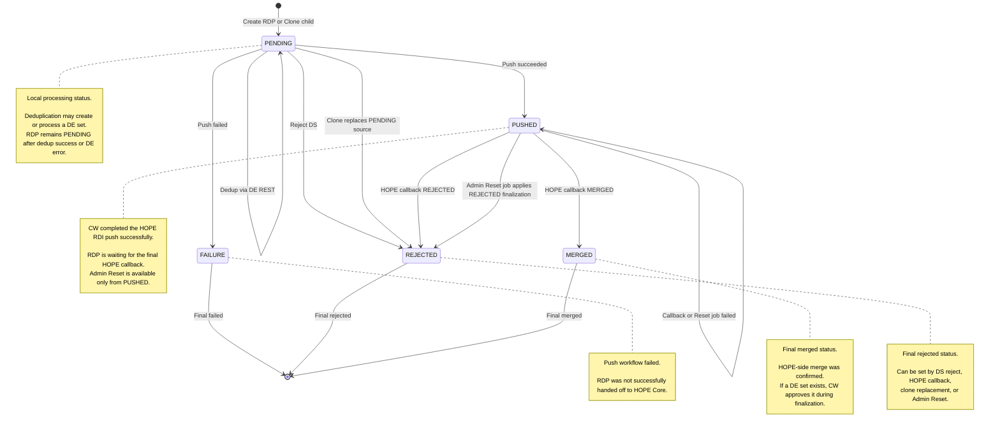
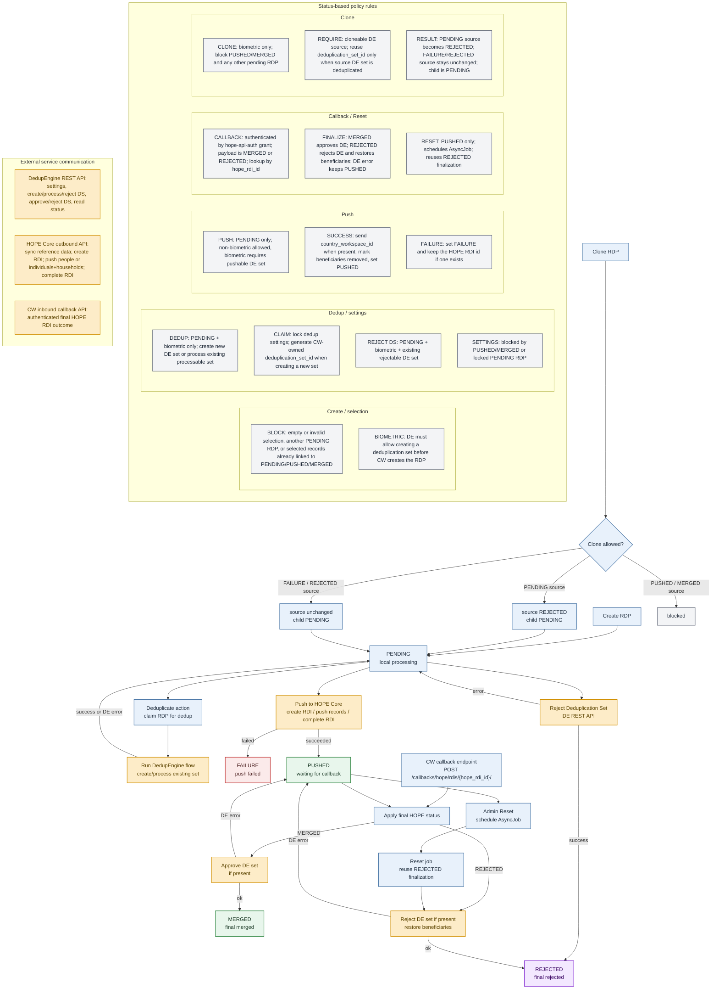

## RDP state flow

## Processing flow and policy rules

## Key rules

* `PENDING` is local processing; `PUSHED` is a hand-off state waiting for the final HOPE callback; `FAILURE`, `REJECTED`, and `MERGED` are final statuses.
* CW handles Deduplication through DedupEngine, not HOPE Deduplication-flow endpoints.
* Dedup claim locks program dedup settings and may generate a CW-owned `deduplication_set_id`; settings stay blocked by locked `PENDING`, `PUSHED`, or `MERGED` RDPs.
* Successful HOPE push marks beneficiaries as removed, stores `hope_rdi_id`, and sets the RDP to `PUSHED`; failed push sets `FAILURE`.
* Final callback is authenticated by `hope-api-auth`, identifies the RDP by `hope_rdi_id`, and accepts only `MERGED` or `REJECTED`.
* Finalization syncs DE when needed: `MERGED` approves the set; `REJECTED` rejects the set and restores removed beneficiaries. DE sync failure leaves the RDP `PUSHED`.
* Admin Reset is only for `PUSHED` RDPs and reuses the same `REJECTED` finalization path.
* Clone requires a biometric program and a cloneable DE source; `PENDING` source becomes `REJECTED`, `FAILURE/REJECTED` source stays unchanged, and the child starts as `PENDING`.
