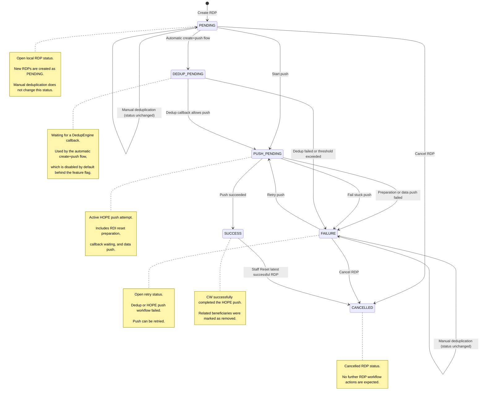
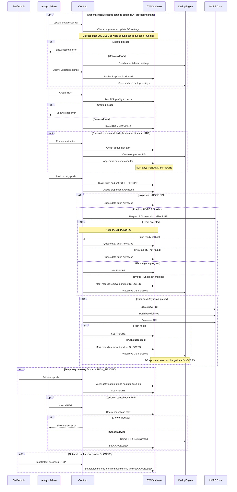
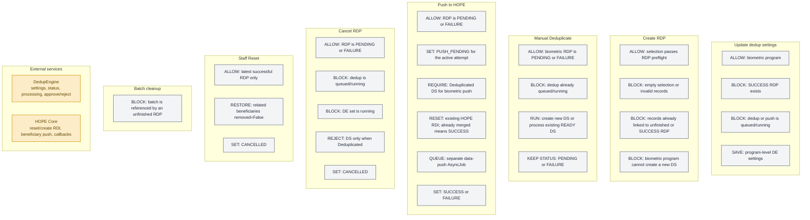

This page describes the current RDP lifecycle and the main processing rules for DedupEngine and HOPE Core integration.

## RDP state flow

## Processing sequence

Most RDP actions are performed from the analyst workspace. Staff Reset and stuck-push recovery are shown from the standard Django admin.

## Policy gates and side effects

## Key rules

* `PENDING` and `FAILURE` are the manual working statuses.
* Manual deduplication does not change the RDP status.
* Push sets `PUSH_PENDING`; only the active push attempt can continue.
* Existing HOPE RDI reset may wait for a callback, fail on merge in progress, or finish as `SUCCESS` if already merged.
* HOPE readiness callback queues a separate data-push AsyncJob.
* Successful push sets `SUCCESS`; failures set `FAILURE`.
* DedupEngine approve runs after successful push and does not change `SUCCESS`.
* Cancel is allowed only from `PENDING` or `FAILURE`.
* Staff Reset changes the latest `SUCCESS` RDP to `CANCELLED`.
* Batch cleanup is blocked for batches referenced by unfinished RDPs.
* Automatic create+push is disabled by default behind the `AUTOMATIC_RDP_PUSH` feature flag.
