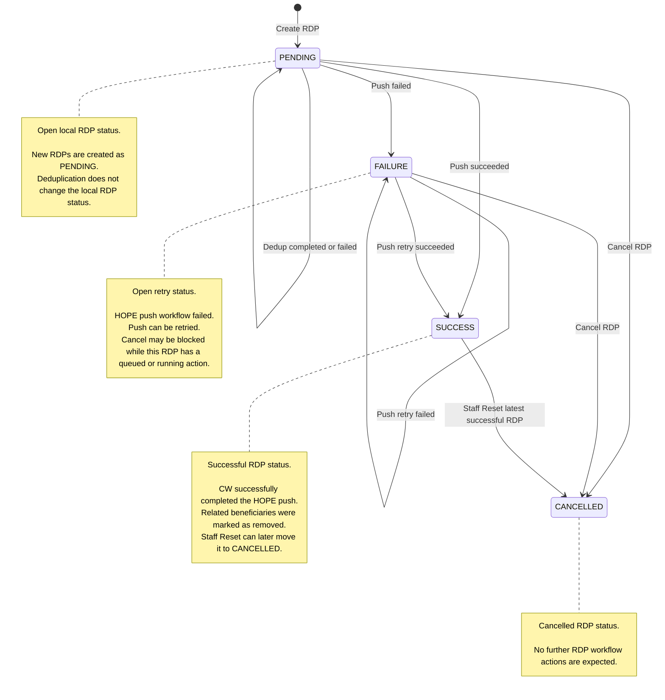
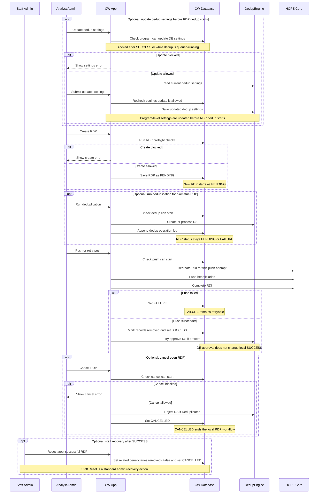
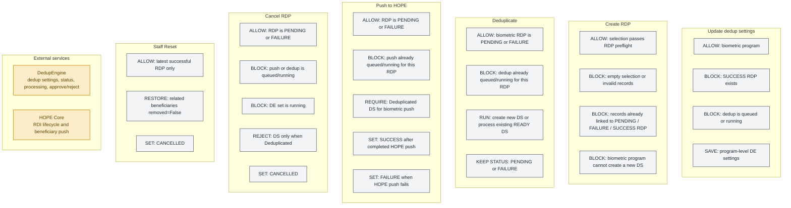

This page describes the current RDP lifecycle and the main processing rules for DedupEngine and HOPE Core integration.

## RDP state flow

## Processing sequence

Most RDP actions are performed from the analyst workspace. Staff Reset is the only action shown here from the standard Django admin.

## Policy gates and side effects

## Key rules

* `PENDING` and `FAILURE` are open local RDP statuses; `FAILURE` can be retried when policy allows it.
* Dedup settings can be updated only for biometric programs, before any successful RDP, and while no deduplication is queued or running.
* RDP preflight blocks empty selections, invalid records, and records already linked to another `PENDING`, `FAILURE`, or `SUCCESS` RDP.
* For biometric programs, RDP creation also requires DedupEngine to allow a new deduplication set.
* Deduplication is available only for biometric `PENDING` or `FAILURE` RDPs.
* Deduplication creates a new DedupEngine set or processes an existing `READY` set; it records an operation log entry but does not change the local RDP status.
* Push retry recreates the HOPE RDI for the current attempt.
* Biometric push requires the DedupEngine set to be `Deduplicated`.
* Successful push marks related beneficiaries as `removed=True`, stores the HOPE RDI id, and sets the RDP to `SUCCESS`.
* After successful push, CW tries to approve the DedupEngine set if present; approval failure is recorded but does not change local `SUCCESS`.
* Cancel is available only for open RDPs when no push, dedup, or running DedupEngine state blocks it.
* Cancel rejects the DedupEngine set only when the remote set is `Deduplicated`; otherwise it only cancels the local RDP.
* Staff Reset is available only for the latest `SUCCESS` RDP and moves it to `CANCELLED` after setting related beneficiaries `removed=False`.
