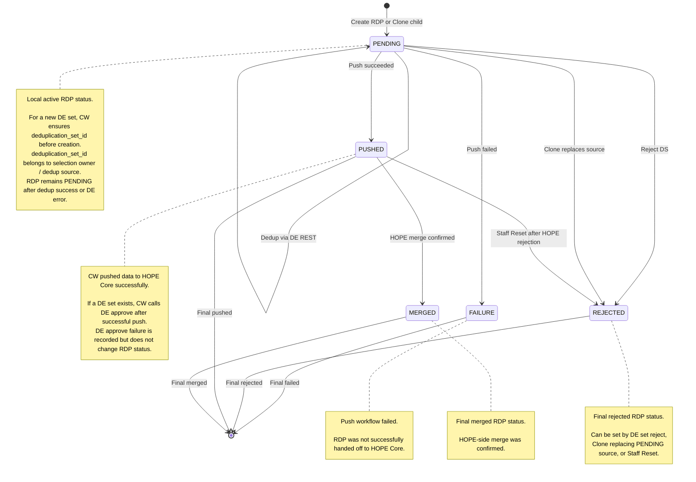
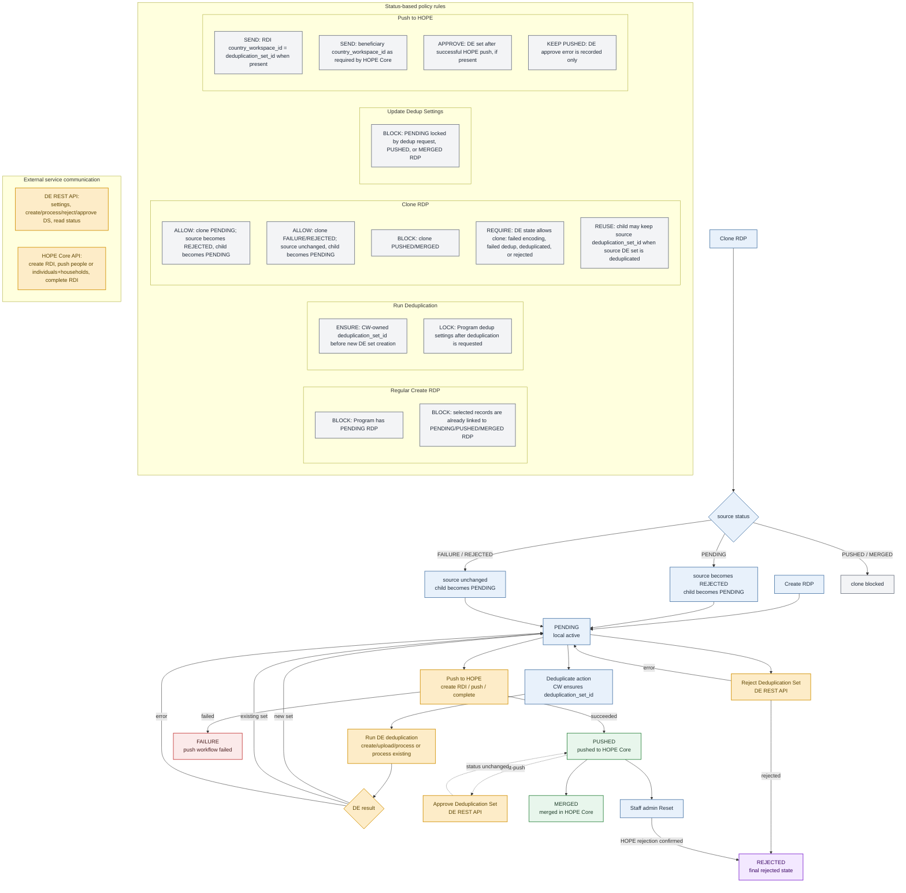

This page describes the current RDP lifecycle and the main processing rules for DedupEngine and HOPE Core integration.

## RDP state flow

## Processing flow and policy rules

## Key rules

- `PENDING` is the only local active RDP status.
- For a new DedupEngine set, `deduplication_set_id` is generated by CW before the create call.
- RDI `country_workspace_id` is sent only when the RDP has `deduplication_set_id`; its value is `str(deduplication_set_id)`.
- `deduplication_set_id` belongs to the selection owner / deduplication source, so clones may reuse it.
- `PUSHED` means CW successfully completed the HOPE push.
- `MERGED` means HOPE-side merge was confirmed.
- If a DedupEngine set exists, approve is called after successful HOPE push. Approval errors are recorded, but RDP status stays `PUSHED`.
- Staff Reset can move `PUSHED` to `REJECTED` when HOPE-side rejection is confirmed manually.
