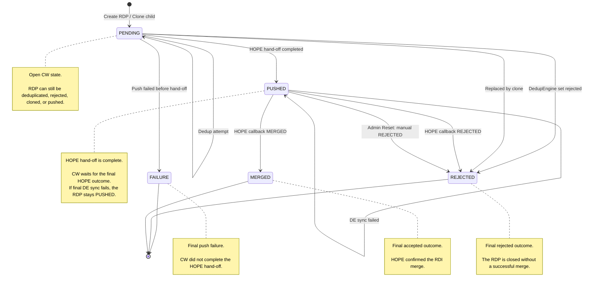
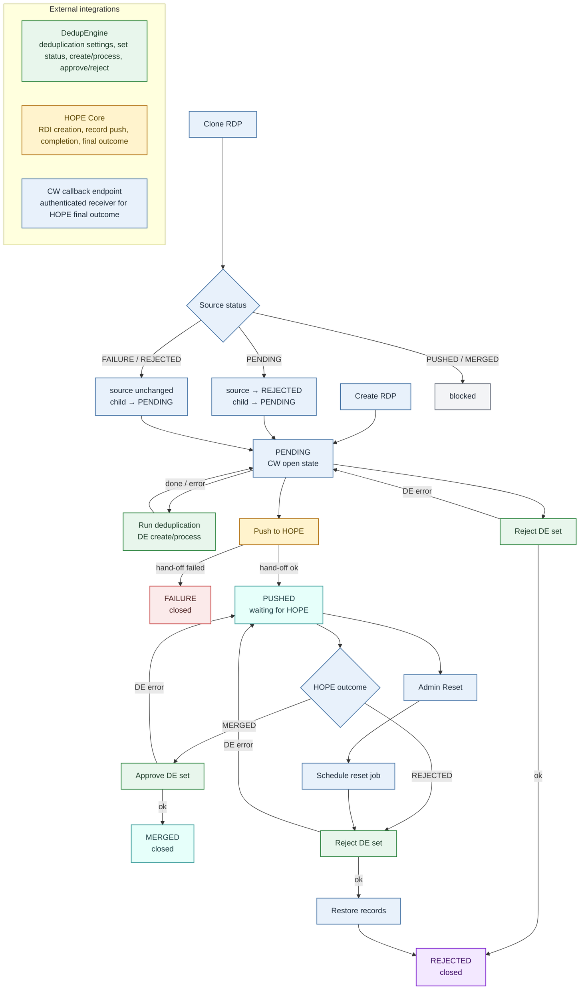
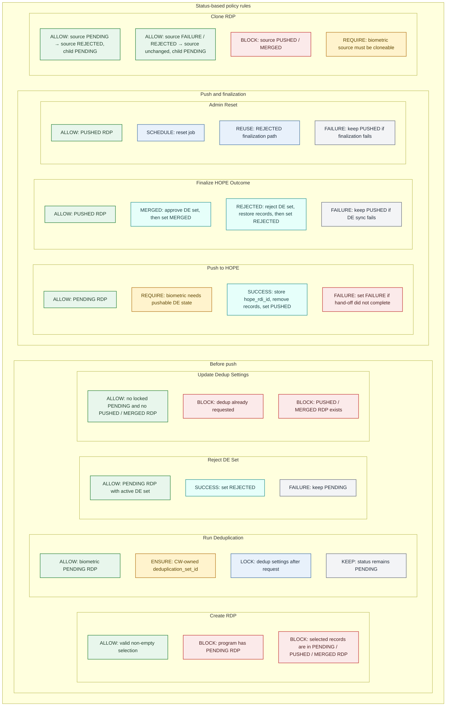

## RDP state flow

## Processing flow

## Policy rules

## Integration boundaries

* CW owns the RDP lifecycle and applies business rules for create, dedup, push, reset, clone, and finalization.
* DedupEngine owns deduplication set state and decisions.
* HOPE Core owns RDI processing and the final merge/rejection outcome.
* CW receives the authenticated HOPE callback and applies that outcome to the RDP.
