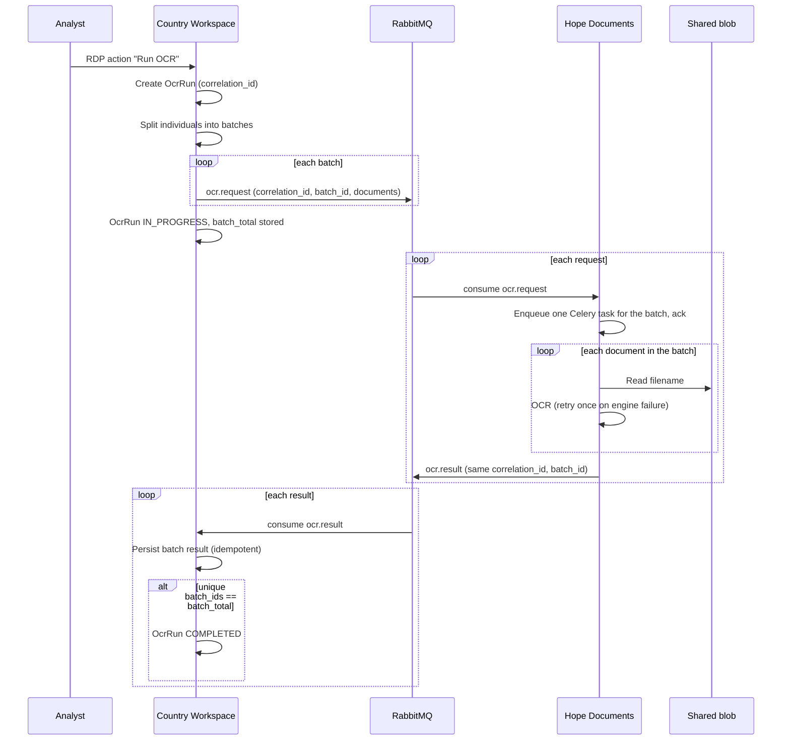

# RDP-triggered OCR (design)

!!! warning "Not implemented"
    This page is the agreed design for the first OCR slice. It is not the current behaviour.

An optional RDP action sends identity-document images to **Hope Documents** over RabbitMQ.
Hope Documents runs OCR and returns batch results. Country Workspace tracks when every batch for that run has come back.

The flow does **not** change RDP status and does **not** block push to HOPE.
It follows the same optional-action pattern as [RDP deduplication](rdp_lifecycle.md).

## Decisions (v1)

| Topic | Decision |
| --- | --- |
| Image access | Shared blob, same as DedupEngine: messages carry a **filename**, not bytes |
| Documents | **One document per individual**. The wire payload is `filename` + `pattern` only |
| Individual stamps | **Out of scope.** Results are kept on the OCR run only |
| Push to HOPE | OCR does **not** gate push |
| Re-run | **Not allowed.** One OCR run per RDP |

Hope Documents only needs an image and a search string. It does not know or care whether that string is a national ID or a passport number.

Country Workspace resolves the image filename and the expected number locally (first populated document pair in `DOCUMENT_TYPES` order: `national_id`, then `national_passport`) and puts the number in `pattern`.
Individuals with no image filename or no number are omitted and do not count toward `batch_total`.

## Identifiers

| Id | Scope | Role |
| --- | --- | --- |
| `correlation_id` | One OCR run | Shared by every request and result for that RDP |
| `rdp_id` | The RDP | Lets both sides log and debug without extra lookups |
| `batch_id` | One RabbitMQ request | Ties a result to the request that produced it |
| `batch_index` / `batch_total` | On every message | Completion is `unique batch_ids == batch_total`. Batches may finish out of order |

`correlation_id` is the OCR run UUID, not `rdp_id`, so a later re-run can be added without changing the contract.

v1 stores a single OCR run per RDP (`OneToOne`). Starting a second run is rejected.

## Message contract

Two routing keys. Each service owns its queue. Country Workspace must **not** bind `cw.#` if it also publishes `cw.*`.

| Direction | Routing key | Queue |
| --- | --- | --- |
| CW → Hope Documents | `ocr.request` | `hope_documents` |
| Hope Documents → CW | `ocr.result` | `results` |

### Request (`ocr.request`)

```json
{
  "correlation_id": "3f2a0c6e-…",
  "rdp_id": 123,
  "batch_id": "9b1d4e2a-…",
  "batch_index": 3,
  "batch_total": 10,
  "documents": [
    {
      "individual_id": 456,
      "filename": "media/…/456.jpg",
      "pattern": "ID-987654"
    }
  ]
}
```

- `filename` is the shared-blob object key, same idea as DedupEngine `{reference_pk, filename}`.
- Batch size defaults to 10 (`IMAGES_TO_DEDUPLICATE_BULK_BATCH_SIZE` / `PUSH_BATCH_SIZE`).
- Do not publish an empty `documents` list. Drop `batch_total` to the number of non-empty batches **before** the first publish.

### Result (`ocr.result`)

```json
{
  "correlation_id": "3f2a0c6e-…",
  "rdp_id": 123,
  "batch_id": "9b1d4e2a-…",
  "batch_index": 3,
  "batch_total": 10,
  "documents": [
    {
      "individual_id": 456,
      "status": "ok",
      "found": true,
      "match": ["ID-987654", 0.0],
      "error": null
    }
  ]
}
```

`status` is `ok` or `error`.

- **`found: false` is a successful OCR result**, not an error. The engine ran; the number was not on the document.
- `error` is for infrastructure / engine failures after the single retry (unreadable file, crash, timeout).

Hope Documents reuses the existing `Processor.find_text` path (the `pattern` branch of `POST /api/upload/`).
That HTTP endpoint stays for manual/debug use. The stream consumer must not call it over HTTP.

## Flow



### 1. Trigger (Country Workspace)

Dedicated RDP workspace action, same family as dedup.

Allowed when:

- RDP status is `PENDING` or `FAILURE`;
- no OCR run exists for this RDP.

Blocked when a run already exists (queued, in progress, completed, or failed), and when the RDP is `SUCCESS` or `CANCELLED`.

The action queues an `AsyncJob`. It does not OCR in the request thread.
Append an `operation_log` entry when the job starts and when it finishes publishing.

### 2. Publish (Country Workspace)

1. Create `OcrRun` with a new `correlation_id`.
2. Iterate RDP individuals, resolve one document each, skip incomplete ones.
3. Split into batches of `n_of_documents_in_message` (default 10).
4. Assign `batch_id`, `batch_index`, `batch_total`.
5. Persist `batch_total` on `OcrRun` **before** the first publish.
6. Publish every `ocr.request`.
7. Set run status to `IN_PROGRESS`.

If publishing fails after some messages are already out, mark the run `FAILED` and keep the `correlation_id`.
Hope Documents may still return later batches; ignore results for a `FAILED` publish only if they cannot be applied safely.
Prefer: keep accepting results if `batch_total` was persisted, so a partial publish that actually completed can still finish.

### 3. Consume and OCR (Hope Documents)

The stream listener validates the request, enqueues **one Celery task per batch**, and acks.

The Celery task processes documents **sequentially** inside the batch (no per-document fan-out in v1):

1. Load the image from the shared blob by `filename`.
2. Run OCR with `pattern` as the search string.
3. On engine/IO failure: retry **once**. If it still fails, set that document `status: error` and continue the batch.
4. When every document in the batch has a result, publish `ocr.result`.

The stream listener must not wait on OCR. RabbitMQ redelivery can replay a whole batch; publishing a result with the same `batch_id` must be safe (CW dedups on consume).

Hope Documents needs `streaming` installed, a listener on `ocr.request`, and read access to the same media account DedupEngine uses.

### 4. Consume results (Country Workspace)

`handle_event` stays thin:

1. Ignore unknown `correlation_id`.
2. Lock the `OcrRun` row. If `batch_id` is already in `received_batch_ids`, no-op.
3. Append `batch_id` and merge that batch's document outcomes into `results`.
4. If `len(received_batch_ids) == batch_total`, mark the run `COMPLETED`.

Do not write onto `Individual` in v1. Operators inspect the run (and `operation_log`) for progress and per-document outcomes.

Heavy post-processing, if added later, belongs on a Celery task after `COMPLETED`, not in the pika callback.

## Persistence (v1)

One `OcrRun` row per RDP (`OneToOne`). **No child table per batch.**

- `correlation_id` (UUID, unique)
- `status`: `PENDING` → `IN_PROGRESS` → `COMPLETED` | `FAILED`
- `batch_total`
- `received_batch_ids` (JSON list)
- `results` (JSON, document outcomes keyed by `batch_id`)

`batch_id` is a message identifier, not a database entity. Dedup of at-least-once RabbitMQ deliveries is “is this `batch_id` already in `received_batch_ids`?”, under a row lock on the run.

A counter-only design is not enough: a redelivered result would be counted twice unless the ids are remembered.

`batch_total` is stored at publish time **and** copied on every message, so the UI and the completion check do not depend on message order.

## Out of scope (v1)

- Writing OCR outcomes onto `Individual` (`errors` / `system_fields`)
- Re-running OCR for the same RDP
- Blocking push to HOPE until OCR completes
- Per-document Celery fan-out / chords
- Timeout watchdog if a batch never returns (should follow soon)
- Recalling in-flight messages when the RDP is cancelled (mark the run ignored; do not try to delete from RabbitMQ)

## Implementation order

1. **Contract and routing** — `ocr.request` / `ocr.result`, streaming config on both services (replace the draft `cw.#` / `hope.*.*` bindings).
2. **CW publish** — RDP action, `OcrRun`, `AsyncJob`, blob filenames, batched publish.
3. **Hope Documents** — consume, shared-blob read, sequential OCR with one retry, publish `ocr.result`.
4. **CW consume** — idempotent persist, mark `COMPLETED`.
5. **Follow-ups** — timeout, Individual stamps, re-run, optional push gate.
