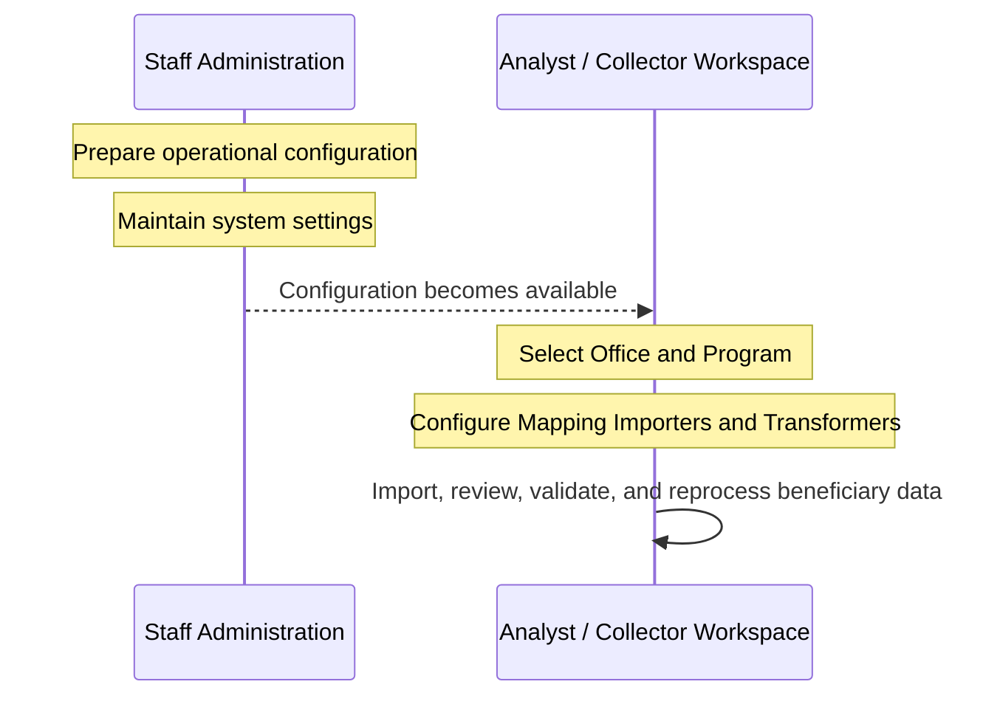

# Interfaces

Country Workspace provides two interfaces for different types of work:

- **Analyst / Collector Workspace** is used for day-to-day work with beneficiary data.
- **Staff Administration** is used to prepare operational configuration and maintain system settings.

Most workflows involve both interfaces: reusable configuration is prepared and maintained by staff, then selected or used during operational work. The relationship between the two interfaces is illustrated in [How the interfaces work together](#how-the-interfaces-work-together).

## Analyst / Collector Workspace

The Analyst / Collector Workspace is the primary interface for working with beneficiary data.

Users first select an **Office** and a **Program**. The selected Program becomes the working context for most operations.

Typical tasks include:

- importing, reviewing, and validating beneficiary data;
- working with Households, Individuals, and Batches;
- configuring import-related components;
- following background jobs and Registration Data Pushes.

Most operational workflows described in this documentation take place in the Analyst / Collector Workspace. For example, users perform imports, review **Batches**, and work with beneficiary records from this interface.

## Staff Administration

Staff Administration is used to prepare operational configuration and maintain system settings.

Typical tasks include:

- configuring [DataCheckers](data_validation/datachecker_configuration.md);
- configuring components used by operational workflows;
- maintaining [system settings](config/constance.md).

Configuration prepared here is then available in the **[Analyst / Collector Workspace](#analyst--collector-workspace)**. Some components can also be configured in either interface, depending on the workflow.

## How the interfaces work together

Staff users prepare the operational configuration and system settings. Analysts and collectors then use this configuration while working with beneficiary data and can maintain some import-related components directly in their workspace.

Most reusable configuration is prepared in **[Staff Administration](#staff-administration)** and then used in the **[Analyst / Collector Workspace](#analyst--collector-workspace)**. Mapping Importers and Transformers can be configured in either interface.

## Unified Classifiers

Unified Classifiers are shared objects [synchronized](config/data_sync.md) with the HOPE main system.
