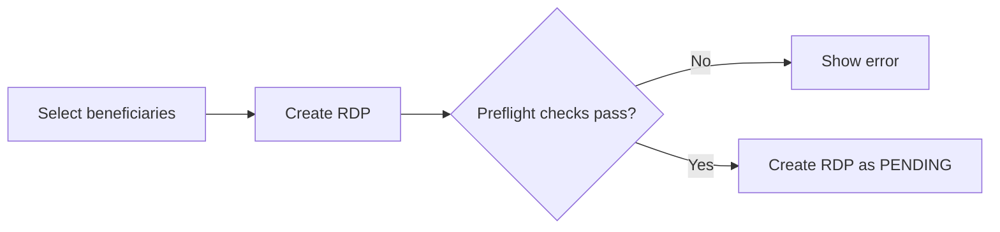

# Create an RDP

A **Registration Data Push (RDP)** contains beneficiary records selected for processing and transfer to HOPE Core.

RDPs are created within the selected **[Program](../program.md)** in the **[Analyst / Collector Workspace](../interfaces.md#analyst--collector-workspace)**.

## Before creating an RDP

Make sure that the required **Office** and **Program** are selected and that the beneficiary records are ready for RDP processing.

Country Workspace checks the selected records before creating the RDP. Creation is blocked when:

* no beneficiaries are selected;
* beneficiary records included in the RDP are invalid;
* selected records are already linked to an unfinished or successful RDP;
* another unfinished RDP already exists for the Program;
* for a biometric Program, a new Deduplication Set cannot be created.

## Create the RDP

Select the beneficiary records that should be processed together and choose **Create RDP**.

Country Workspace performs the RDP preflight checks before saving the new RDP.

If the checks succeed, the RDP is created in `PENDING` status.

If a check fails, the RDP is not created and Country Workspace displays the reason.

## After creation

A newly created RDP remains in `PENDING` and can proceed through the processing steps required for the selected Program.

Depending on the Program configuration, additional processing may be required before the RDP can be pushed to HOPE Core.

See **[RDP deduplication](deduplication.md)** for biometric deduplication and **[Push to HOPE Core](push.md)** for the push workflow.

For the complete RDP state flow, see **[Lifecycle and statuses](lifecycle.md)**.
