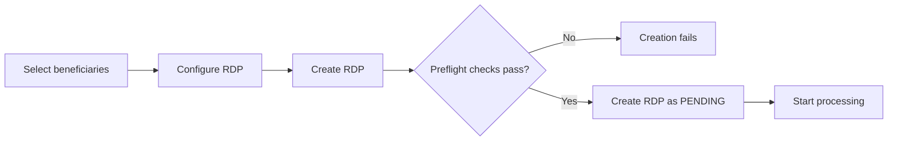

# Create an RDP

A **Registration Data Push (RDP)** contains beneficiary records selected for processing and transfer to HOPE Core.

RDPs are created within the selected **[Program](../program.md)** in the **[Analyst / Collector Workspace](../interfaces.md#analyst--collector-workspace)**.

## Before creating an RDP

Make sure that the required **Office** and **Program** are selected and that the beneficiary records are ready for RDP processing.

Country Workspace checks the selected records before creating the RDP. Creation is blocked when:

- no beneficiaries are selected;
- selected beneficiary records are invalid;
- selected records are already linked to an unfinished or successful RDP;
- another unfinished RDP already exists for the Program.

## Configure RDP processing

Select the beneficiary records and choose **Create RDP**.

The creation page shows configuration for the RDP operations enabled for the selected Program.

For example, when biometric deduplication is enabled, the form includes the biometric findings threshold used to decide whether manual review is required.

See **[RDP operations](operations/index.md)** for the common operation flow and **[Biometric deduplication](operations/deduplication.md)** for biometric settings.

## Create the RDP

After the configuration is confirmed, Country Workspace schedules RDP creation.

Country Workspace runs the RDP preflight checks before saving the RDP.

If the checks succeed:

- the RDP is created in `PENDING` status;
- the selected beneficiaries are linked to it;
- the configured operations are created;
- RDP processing starts automatically.

If a check fails, the RDP is not created and the failure is recorded in the background job.

```mermaid
flowchart LR
    A[Select beneficiaries]
        --> B[Configure RDP]
        --> C[Create RDP]
        --> D{Preflight checks pass?}
    D -->|No| E[Creation fails]
    D -->|Yes| F[Create RDP as PENDING]
    F --> G[Start processing]
```

## After creation

The RDP remains `PENDING` while its configured operations are being processed.

When all required operations complete successfully, Country Workspace continues the RDP workflow and checks whether manual review is required.

If no operations are configured, Country Workspace continues processing the RDP without waiting for an operation.

See **[RDP operations](operations/index.md)** for processing and **[Lifecycle and statuses](lifecycle.md)** for the RDP state flow.
