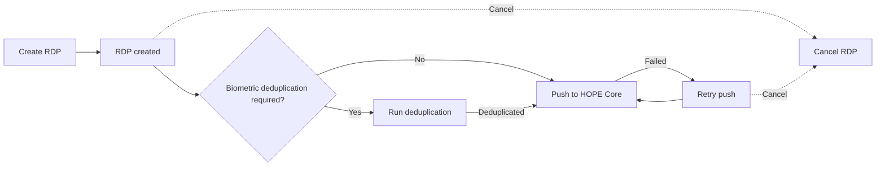

# Registration Data Pushes

A **Registration Data Push (RDP)** groups beneficiary records that are prepared and pushed from Country Workspace to HOPE Core.

RDPs are managed within the selected **[Program](../program.md)** in the **[Analyst / Collector Workspace](../interfaces.md#analyst--collector-workspace)**.

For Programs with biometric deduplication enabled, deduplication is performed as a separate step before the RDP can be pushed.

## RDP workflow

Creating an RDP starts the workflow. For biometric Programs, deduplication must complete successfully before the RDP can be pushed to HOPE Core.

A failed push can be retried, and an open RDP can be cancelled when the cancellation requirements are satisfied.

See **[Lifecycle and statuses](lifecycle.md)** for RDP statuses and transitions.

## Before creating an RDP

Make sure that the required **Office** and **[Program](../program.md)** are selected and the beneficiary records are ready for processing.

Country Workspace performs additional checks before creating an RDP. See **[Create an RDP](create.md)** for the creation process and conditions that can prevent it.

## Biometric deduplication

For Programs with biometric deduplication enabled, the RDP must be successfully deduplicated before it can be pushed to HOPE Core.

See **[RDP deduplication](deduplication.md)** for the deduplication workflow and **[Program](../program.md#deduplication-settings)** for deduplication settings.

## Push to HOPE Core

The push runs asynchronously and may include resetting an existing HOPE RDI before beneficiary data is sent.

See **[Push to HOPE Core](push.md)** for the push workflow, retries, and successful completion.

## Troubleshooting

See **[Troubleshooting](troubleshooting.md)** if an RDP cannot be created, deduplication fails, or a push does not complete as expected.
