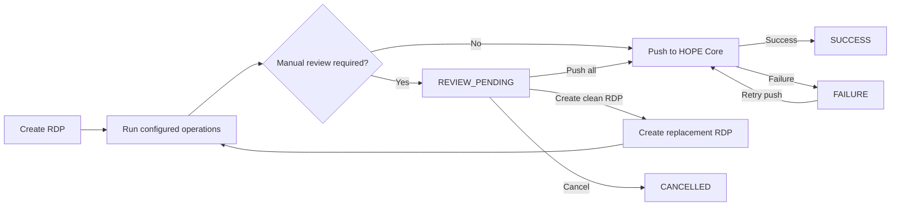

# Registration Data Pushes

A **Registration Data Push (RDP)** groups beneficiary records that are processed and pushed from Country Workspace to HOPE Core.

RDPs are managed within the selected **[Program](../program.md)** in the **[Analyst / Collector Workspace](../interfaces.md#analyst--collector-workspace)**.

## RDP workflow

```mermaid
flowchart LR
    A[Create RDP] --> B[Run configured operations]
    B --> C{Manual review required?}
    C -->|No| D[Push to HOPE Core]
    C -->|Yes| E[REVIEW_PENDING]
    E -->|Push all| D
    E -->|Create clean RDP| F[Create replacement RDP]
    F --> B
    E -->|Cancel| G[CANCELLED]
    D -->|Success| H[SUCCESS]
    D -->|Failure| I[FAILURE]
    I -->|Retry push| D
```

Creating an RDP starts its processing automatically.

Depending on the Program configuration, Country Workspace may run one or more **[RDP operations](operations/index.md)** before the RDP can be pushed to HOPE Core.

If manual review is required, the RDP moves to `REVIEW_PENDING`. The user can then push all beneficiaries, create a clean RDP, or cancel the RDP.

A failed push can be retried.

See **[Lifecycle and statuses](lifecycle.md)** for the complete RDP state flow.

## Create an RDP

Select the beneficiary records that should be processed together and use **Create RDP**.

Country Workspace validates the selection, creates the RDP, and starts its configured processing.

See **[Create an RDP](create.md)** for details.

## RDP operations

RDP operations are processing steps that run before the RDP can be pushed to HOPE Core.

The operations enabled for an RDP depend on the Program configuration.

Currently, **[biometric deduplication](operations/deduplication.md)** is supported.

See **[RDP operations](operations/index.md)** for the common operation flow.

## Push to HOPE Core

After processing is complete and the RDP is ready to continue, Country Workspace pushes its beneficiary records to HOPE Core.

See **[Push to HOPE Core](push.md)** for the push workflow and retries.

## Troubleshooting

See **[Troubleshooting](troubleshooting.md)** if RDP creation, processing, review, or push does not complete as expected.
