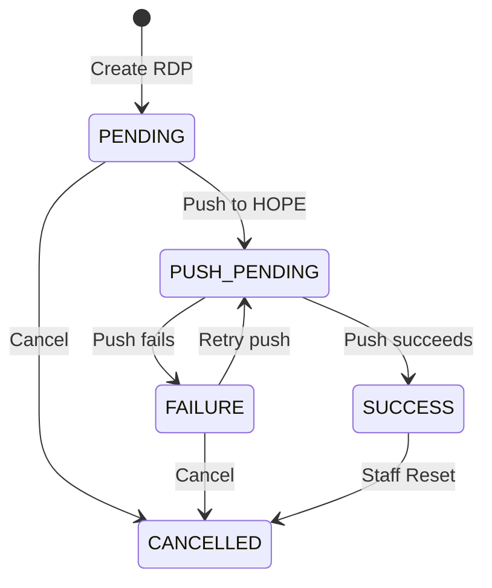

# Lifecycle and statuses

An **[RDP](index.md)** moves through a small set of statuses from creation to completion or cancellation.

The RDP status describes the overall Country Workspace workflow. For biometric Programs, the **Dedup engine state** is tracked separately from the RDP status.

## RDP state flow

Deduplication is not shown as a state transition because running deduplication does not change the RDP status.

## Statuses

| Status | Meaning |
| --- | --- |
| `PENDING` | The RDP is open and ready for the processing required by the Program. |
| `PUSH_PENDING` | A push to HOPE is in progress. This can include RDI reset, waiting for HOPE, and data transfer. |
| `SUCCESS` | The RDP push completed successfully. |
| `FAILURE` | The push attempt failed. The RDP remains open and can be retried when the required conditions are satisfied. |
| `CANCELLED` | The RDP was cancelled and no further processing is expected. |

Only one unfinished RDP can exist for a Program at a time.

## Deduplication and RDP status

For biometric Programs, deduplication is a separate part of the RDP workflow.

Running deduplication does not change the RDP status. An RDP in `PENDING` remains `PENDING`, and an RDP in `FAILURE` remains `FAILURE`.

The current DedupEngine state is used to determine whether deduplication can run and whether the RDP can be pushed.

See **[RDP deduplication](deduplication.md)** for details.

## Push status changes

Starting a push from `PENDING`, or retrying one from `FAILURE`, changes the RDP to `PUSH_PENDING`.

The RDP remains `PUSH_PENDING` while the push is being prepared, while Country Workspace is waiting for HOPE when necessary, and while beneficiary data is being sent.

A successful push changes the RDP to `SUCCESS`. If the push fails, the RDP changes to `FAILURE` and can be retried when the push requirements are satisfied.

See **[Push to HOPE Core](push.md)** for the complete push workflow.

## Cancel an RDP

The **Cancel** button is available for RDPs in `PENDING` or `FAILURE`.

Cancellation is blocked while deduplication is queued or running.

For a biometric RDP whose associated Deduplication Set is `Deduplicated`, Country Workspace rejects the set in DedupEngine before changing the RDP to `CANCELLED`.

## Staff Reset

In **[Staff Administration](../interfaces.md#staff-administration)**, the latest `SUCCESS` RDP for a Program can be reset.

Reset marks the beneficiaries represented by the RDP as not removed and changes the RDP from `SUCCESS` to `CANCELLED`.

Staff Reset changes the Country Workspace state only. It does not reverse processing already completed in HOPE Core.

## Processing flow

For a detailed view of how Country Workspace, DedupEngine, and HOPE Core interact during RDP processing, see **[RDP processing flow](processing.md)**.
