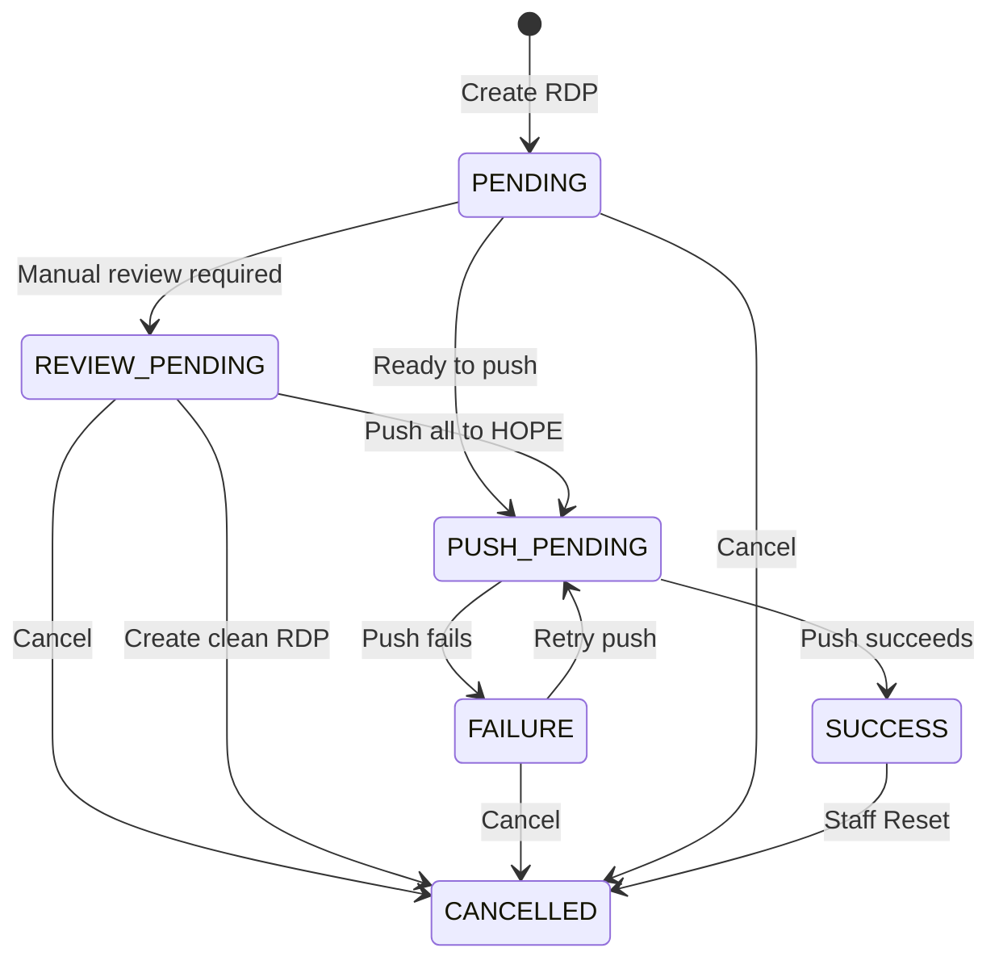

# Lifecycle and statuses

An **[RDP](index.md)** moves through a small set of statuses from creation to completion or cancellation.

The RDP status describes the overall Country Workspace workflow. Individual **[RDP operations](operations/index.md)** have their own statuses and do not directly replace the RDP status.

## RDP state flow

```mermaid
stateDiagram-v2
    [*] --> PENDING: Create RDP

    PENDING --> REVIEW_PENDING: Manual review required
    PENDING --> PUSH_PENDING: Ready to push

    REVIEW_PENDING --> PUSH_PENDING: Push all to HOPE
    REVIEW_PENDING --> CANCELLED: Cancel
    REVIEW_PENDING --> CANCELLED: Create clean RDP

    PUSH_PENDING --> SUCCESS: Push succeeds
    PUSH_PENDING --> FAILURE: Push fails

    FAILURE --> PUSH_PENDING: Retry push
    FAILURE --> CANCELLED: Cancel

    PENDING --> CANCELLED: Cancel
    SUCCESS --> CANCELLED: Staff Reset
```

A clean RDP is created as a new `PENDING` RDP and starts its own processing. See **[Biometric deduplication](operations/deduplication.md#create-clean-rdp)** for the clean replacement flow.

## Statuses

| Status | Meaning |
| --- | --- |
| `PENDING` | The RDP is being processed before push. Configured operations may still be pending, running, or waiting to be retried. |
| `REVIEW_PENDING` | Processing completed, but manual review is required before the RDP can continue. |
| `PUSH_PENDING` | A push to HOPE Core is in progress. This can include RDI reset, waiting for HOPE, and data transfer. |
| `SUCCESS` | The RDP push completed successfully. |
| `FAILURE` | The push attempt failed. The RDP can be retried when the required conditions are satisfied. |
| `CANCELLED` | The RDP was cancelled and no further processing is expected. |

Only one non-terminal RDP can exist for a Program at a time. `PENDING`, `REVIEW_PENDING`, `PUSH_PENDING`, and `FAILURE` are non-terminal statuses.

## Processing and review

A newly created RDP starts in `PENDING`.

Country Workspace runs the **[operations configured for the RDP](operations/index.md)** while the RDP remains in this status. An operation failure also leaves the RDP in `PENDING`; failed operations can be retried independently.

After all required operations complete successfully, Country Workspace checks whether manual review is required. If not, the RDP moves to `PUSH_PENDING` and the HOPE Core push starts automatically. If review is required, the RDP moves to `REVIEW_PENDING`.

From `REVIEW_PENDING`, the user can **Push all to HOPE**, **Create clean RDP**, or **Cancel RDP**. See **[Biometric deduplication](operations/deduplication.md#manual-review)** for the current review flow.

## Push status changes

When the RDP is ready to be pushed, its status changes to `PUSH_PENDING`.

The RDP remains `PUSH_PENDING` while Country Workspace prepares HOPE Core, waits for HOPE when necessary, and sends beneficiary data.

A successful push changes the RDP to `SUCCESS`. A failed push changes it to `FAILURE`; use **Retry push to HOPE** to start another push attempt.

See **[Push to HOPE Core](push.md)** for the complete push workflow.

## Recover a stuck push

If an RDP remains in `PUSH_PENDING` because the push can no longer continue, authorized staff can use **Fail stuck push** in Staff Administration.

Use this recovery action only after confirming that the push preparation job is no longer running and, when applicable, that the HOPE callback is no longer expected.

Country Workspace verifies that the selected push attempt is still active, that its preparation job exists, and that the data push has not already been scheduled. If recovery is allowed, the RDP changes to `FAILURE` and can then be retried.

**Fail stuck push** is a temporary recovery action and is expected to be removed when automatic recovery is available.

See **[Push to HOPE Core](push.md)** for retrying a failed push and **[Troubleshooting](troubleshooting.md)** for recovery guidance.

## Cancel an RDP

**Cancel RDP** is available for RDPs in `PENDING`, `REVIEW_PENDING`, or `FAILURE`.

Cancellation is blocked while an RDP operation is `PENDING` or `RUNNING`.

For biometric RDPs, Country Workspace also handles the associated DedupEngine set when required before completing the cancellation.

See **[RDP operations](operations/index.md#operation-statuses)** for operation statuses and **[Biometric deduplication](operations/deduplication.md)** for biometric processing.

## Staff Reset

In **[Staff Administration](../interfaces.md#staff-administration)**, the latest `SUCCESS` RDP for a Program can be reset.

Reset marks the related beneficiary records as not removed and changes the RDP from `SUCCESS` to `CANCELLED`.

Staff Reset changes Country Workspace state only. It does not reverse processing already completed in HOPE Core.

## Processing flow

For a detailed view of how Country Workspace, RDP operations, DedupEngine, and HOPE Core interact, see **[RDP processing flow](processing.md)**.
