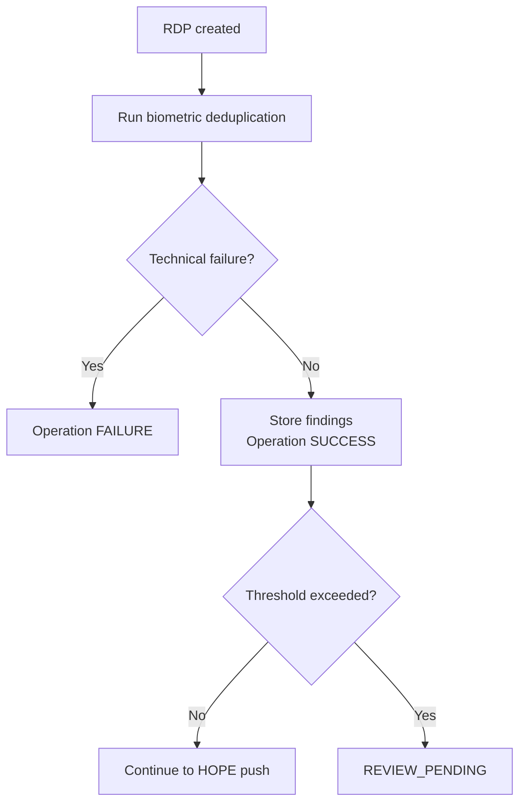

# Biometric deduplication

Biometric deduplication checks beneficiary photos for duplicate people and image-related problems before an **[RDP](../index.md)** can be pushed to HOPE Core.

It runs as an **[RDP operation](index.md)** when biometric deduplication is enabled for the selected Program.

## Configuration

When creating an RDP, Country Workspace shows the biometric deduplication settings for Programs where this operation is enabled.

The **biometric findings threshold** controls when the RDP requires manual review. It can be configured as **Number of findings** or **Findings per 100 RDP individuals**. The default threshold value is `0`.

For household-based Programs, the rate is calculated using actual household members. External collectors are not included.

See **[Create an RDP](../create.md)** for the RDP creation flow.

## Processing

Biometric deduplication starts automatically after the RDP is created.

Before creating a new Deduplication Set, Country Workspace checks that the RDP contains at least one beneficiary photo. If no photo is available, the operation fails before the set is created.

Country Workspace then creates or resumes the corresponding Deduplication Set, uploads the available beneficiary photos when needed, and starts processing.

The biometric operation remains `RUNNING` while DedupEngine processes the set. When processing completes, Country Workspace retrieves and stores the findings.

The RDP itself remains `PENDING` while the operation is running.

A technical failure and a biometric finding are different outcomes. A technical failure changes the operation to `FAILURE`; duplicate or image-related findings are valid results, so the operation can still complete with `SUCCESS`.

See **[RDP operations](index.md)** for the common operation lifecycle.

## Findings

Biometric findings include duplicate people and image-related issues such as `NO_FACE_DETECTED`, `FACE_NOT_ACCEPTED`, `BAD_IMAGE_QUALITY`, and `MULTIPLE_FACES_DETECTED`.

For a duplicate finding, Country Workspace links the matching Individual when that Individual exists locally in the same Program. The match can be outside the current RDP.

External collectors are not included in biometric deduplication.

Biometric results are also shown on the relevant Individual and Household pages. For households, duplicate and image-issue counts are based on actual household members.

## Manual review

After successful biometric processing, Country Workspace evaluates the biometric findings against the configured threshold.

If the threshold is not exceeded, the RDP continues automatically to the **[HOPE Core push](../push.md)**.

If the threshold is exceeded, the RDP moves to `REVIEW_PENDING`. The user can then **Push all to HOPE**, **Create clean RDP**, or **Cancel RDP**.

See **[Lifecycle and statuses](../lifecycle.md)** for the complete RDP state flow.

## Create clean RDP

**Create clean RDP** creates a replacement RDP without beneficiaries affected by biometric findings.

For people-only Programs, affected Individuals are excluded. For household-based Programs, the whole Household is excluded when any actual household member is affected. External collectors do not cause a Household to be excluded.

A duplicate counterpart outside the current RDP is not part of the clean selection.

The original RDP is changed to `CANCELLED`, and its DedupEngine set is rejected. After that cleanup completes, processing starts for the replacement RDP.

The replacement RDP keeps the configured operations, but its biometric threshold is reset to **Number of findings = 0**. This means any biometric finding in the replacement RDP requires manual review again.

See **[RDP workflow](../index.md#rdp-workflow)** for how the replacement RDP returns to the normal processing flow.

## Failed biometric operation

If biometric processing cannot start or complete, the operation changes to `FAILURE` while the RDP remains `PENDING`.

The failure reason is shown in the RDP **Operations** section. Use **Retry failed operations** to retry the failed operation.

See **[Operation statuses](index.md#operation-statuses)** for the common retry behavior.

## Operation details

The RDP **Operations** section shows the biometric operation status, correlation ID, timing, attempts, configuration, errors, and log. After successful processing, it also shows the number of findings and affected Individuals.

See **[Operation details](index.md#operation-details)** for the common operation information.
