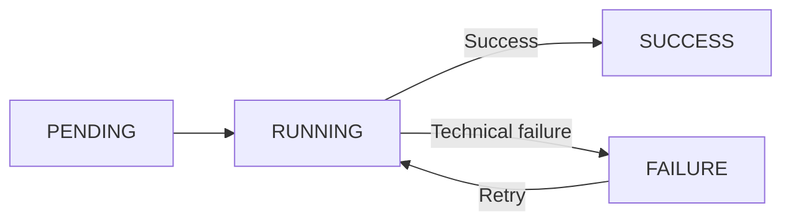

# RDP operations

RDP operations are processing steps that run after an **[RDP](../index.md)** is created and before it can be pushed to HOPE Core.

The operations enabled for an RDP depend on the selected Program. Currently, **[biometric deduplication](deduplication.md)** is supported.

## Configuration

During **[RDP creation](../create.md#configure-rdp-processing)**, Country Workspace determines which operations are enabled for the selected Program and shows their configuration.

The submitted settings are validated and stored with each configured operation. This configuration belongs to that RDP operation and is reused if the operation is retried.

For example, biometric deduplication stores the **[findings threshold](deduplication.md#configuration)** that is later used to decide whether manual review is required.

The configured operations are created together with the RDP and start processing automatically after creation.

## Processing

Each configured operation starts in `PENDING` and is processed independently. The RDP remains `PENDING` until all configured operations complete successfully.

A failed operation can be retried with **Retry failed operations**. The same configured operation is run again; the RDP itself remains `PENDING`.

If no operations are configured, Country Workspace continues processing the RDP without waiting for an operation.

See **[RDP processing flow](../processing.md)** for how operations fit into the complete RDP workflow.

## Operation statuses

| Status | Meaning |
| --- | --- |
| `PENDING` | The operation is waiting to start. |
| `RUNNING` | The operation is running. |
| `SUCCESS` | The operation completed successfully. |
| `FAILURE` | The operation failed and can be retried. |

An operation can complete with `SUCCESS` and still produce business findings. For example, **[biometric deduplication](deduplication.md#findings)** can report duplicate or image-related findings without being considered a technical failure.

Country Workspace continues the RDP workflow only after all configured operations are `SUCCESS`.

## Operation details

The RDP page contains an **Operations** section for configured operations.

For each operation, it shows the status, correlation ID, timing, number of attempts, configuration, errors, log, and any operation-specific results.

See the documentation for each operation for details about its configuration and results.
