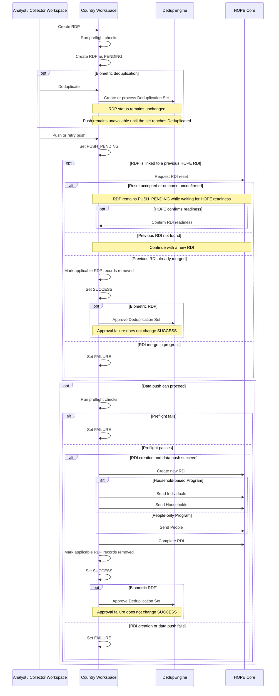

# RDP processing flow

This page shows how Country Workspace interacts with DedupEngine and HOPE Core during RDP processing.

For RDP status definitions and transitions, see **[Statuses](lifecycle.md#statuses)** and **[RDP state flow](lifecycle.md#rdp-state-flow)**.

## Processing sequence

## Related documentation

See **[Create the RDP](create.md#create-the-rdp)** for RDP creation and preflight checks, **[Run deduplication](deduplication.md#run-deduplication)** for biometric processing, and **[Start the push](push.md#start-the-push)** for the standard HOPE push flow.

For an RDP linked to a previous HOPE RDI, see **[Retry a failed push](push.md#retry-a-failed-push)** for the RDI reset and retry flow.

For lifecycle operations outside the normal processing sequence, see **[Cancel an RDP](lifecycle.md#cancel-an-rdp)** and **[Staff Reset](lifecycle.md#staff-reset)**.
