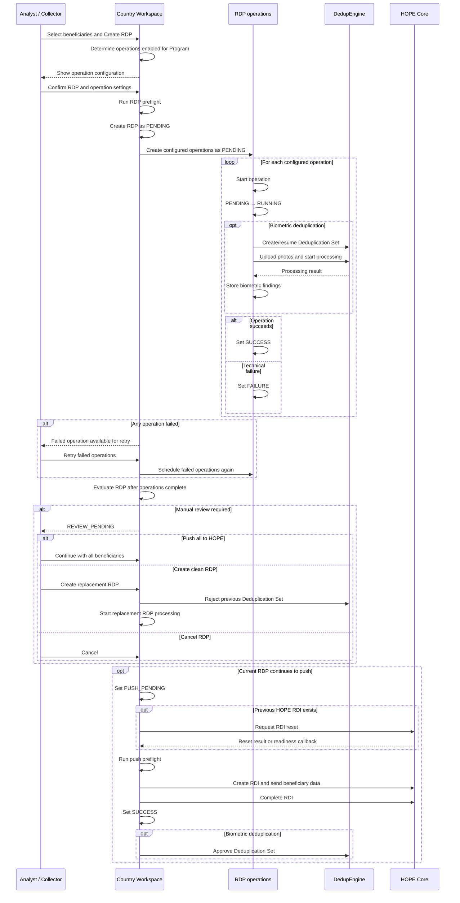

# RDP processing flow

This page shows the end-to-end **[RDP](index.md)** flow from creation and configured **[RDP operations](operations/index.md)** to review and the **[HOPE Core push](push.md)**.

For RDP status transitions, see **[Lifecycle and statuses](lifecycle.md)**.

## Processing sequence

```mermaid
sequenceDiagram
    participant User as Analyst / Collector
    participant CW as Country Workspace
    participant OP as RDP operations
    participant DE as DedupEngine
    participant HOPE as HOPE Core

    User->>CW: Select beneficiaries and Create RDP
    CW->>CW: Determine operations enabled for Program
    CW-->>User: Show operation configuration
    User->>CW: Confirm RDP and operation settings

    CW->>CW: Run RDP preflight
    CW->>CW: Create RDP as PENDING
    CW->>OP: Create configured operations as PENDING

    loop For each configured operation
        OP->>OP: Start operation
        OP->>OP: PENDING → RUNNING

        opt Biometric deduplication
            OP->>DE: Create/resume Deduplication Set
            OP->>DE: Upload photos and start processing
            DE-->>OP: Processing result
            OP->>OP: Store biometric findings
        end

        alt Operation succeeds
            OP->>OP: Set SUCCESS
        else Technical failure
            OP->>OP: Set FAILURE
        end
    end

    alt Any operation failed
        CW-->>User: Failed operation available for retry
        User->>CW: Retry failed operations
        CW->>OP: Schedule failed operations again
    end

    CW->>CW: Evaluate RDP after operations complete

    alt Manual review required
        CW-->>User: REVIEW_PENDING

        alt Push all to HOPE
            User->>CW: Continue with all beneficiaries
        else Create clean RDP
            User->>CW: Create replacement RDP
            CW->>DE: Reject previous Deduplication Set
            CW->>CW: Start replacement RDP processing
        else Cancel RDP
            User->>CW: Cancel
        end
    end

    opt Current RDP continues to push
        CW->>CW: Set PUSH_PENDING

        opt Previous HOPE RDI exists
            CW->>HOPE: Request RDI reset
            HOPE-->>CW: Reset result or readiness callback
        end

        CW->>CW: Run push preflight
        CW->>HOPE: Create RDI and send beneficiary data
        CW->>HOPE: Complete RDI
        CW->>CW: Set SUCCESS

        opt Biometric deduplication
            CW->>DE: Approve Deduplication Set
        end
    end
```

Operation configuration is part of **[RDP creation](create.md#configure-rdp-processing)**. Country Workspace stores the configuration for each enabled operation and creates those operations together with the RDP.

After creation, operations run independently while the RDP remains `PENDING`. Failed operations can be retried, and the RDP continues only after all configured operations complete successfully.

See **[RDP operations](operations/index.md)** for configuration, statuses, retries, and common operation behavior.

## Operation results and review

An operation can complete successfully while still producing findings that affect the next RDP step.

For **[biometric deduplication](operations/deduplication.md)**, Country Workspace evaluates the stored findings against the configured threshold after all operations have completed successfully.

If manual review is not required, processing continues automatically to the **[HOPE Core push](push.md)**. Otherwise, the RDP moves to `REVIEW_PENDING`.

See **[Manual review](operations/deduplication.md#manual-review)** for the available review decisions.

## Push to HOPE Core

Once the RDP is ready to continue, its status changes to `PUSH_PENDING`.

Country Workspace prepares HOPE Core, resets a previous RDI when required, repeats the push preflight checks, creates a new RDI when needed, sends the beneficiary data, and completes the RDI.

A successful push changes the RDP to `SUCCESS`; a push failure changes it to `FAILURE` and can be retried.

See **[Push to HOPE Core](push.md)** for the detailed push flow and **[Recover a stuck push](lifecycle.md#recover-a-stuck-push)** for an interrupted `PUSH_PENDING` attempt.
