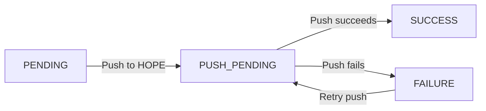

# Push to HOPE Core

Pushing an **[RDP](index.md)** transfers its beneficiary records from Country Workspace to HOPE Core. Country Workspace sends the data as a Registration Data Import (RDI) in HOPE Core.

## When push is available

The **Push to HOPE** button is shown for RDPs in `PENDING` or `FAILURE` status.

For Programs with biometric deduplication enabled, the associated Deduplication Set must be `Deduplicated` before the push can start.

The button is disabled while deduplication is queued or running, or when the RDP does not satisfy the requirements for push.

## Start the push

Open the RDP and click **Push to HOPE**.

Country Workspace changes the RDP status to `PUSH_PENDING` and schedules a background job to prepare the push.

Before sending data, Country Workspace runs the RDP preflight checks again. If the checks fail, the RDP becomes `FAILURE`.

When the RDP is ready to be sent, Country Workspace creates a new RDI in HOPE Core, sends the beneficiary data, and completes the RDI.

For household-based Programs, Individuals are sent before Households. For people-only Programs, People are sent directly.

## Retry a failed push

An RDP in `FAILURE` can be pushed again when the push requirements are satisfied.

If the RDP is linked to a previous HOPE RDI, Country Workspace first requests an RDI reset in HOPE before retrying the push. The RDP remains `PUSH_PENDING` while Country Workspace waits for HOPE when necessary.

If the previous RDI no longer exists in HOPE, the push continues with a new RDI. If HOPE reports that the previous RDI has already been merged, Country Workspace completes the RDP as `SUCCESS` without sending the beneficiary data again.

A retry fails if HOPE reports that the previous RDI merge is still in progress.

## Related jobs

A push can create separate background jobs for push preparation and data transfer. **Related jobs** shows these jobs and their execution status.

A successful preparation job does not necessarily mean that the push has finished. The RDP remains `PUSH_PENDING` while it is waiting for HOPE or while the data push is still running.

Use the RDP **Status** to check the overall result of the push.

## Collectors

When a selected Household references an Individual as Primary or Alternate Collector, Country Workspace includes that Individual in the push, whether or not the collector is a member of the Household.

If several Households in the same RDP reference the same collector, that Individual is sent once. If the referencing Households are pushed in separate RDPs, the collector can be included in each push.

After a successful push, Individuals who are members of the selected Households are marked as removed. Collectors included only through Primary or Alternate Collector references are not marked as removed.

See **[External collectors](../data_import/sources/kobo.md#external-collectors)** for source-specific information about collectors stored outside a Household.

## After a successful push

After a successful push, Country Workspace stores the HOPE RDI ID and sets the RDP to `SUCCESS`.

For household-based Programs, the selected Households and their members are marked as removed. For people-only Programs, the selected People are marked as removed.

For biometric RDPs, Country Workspace also attempts to approve the associated Deduplication Set in DedupEngine. The result is recorded in the **Operation log**. An approval failure does not change the RDP from `SUCCESS`.

See **[Lifecycle and statuses](lifecycle.md)** for RDP status transitions and **[RDP processing flow](processing.md)** for the detailed processing sequence.
