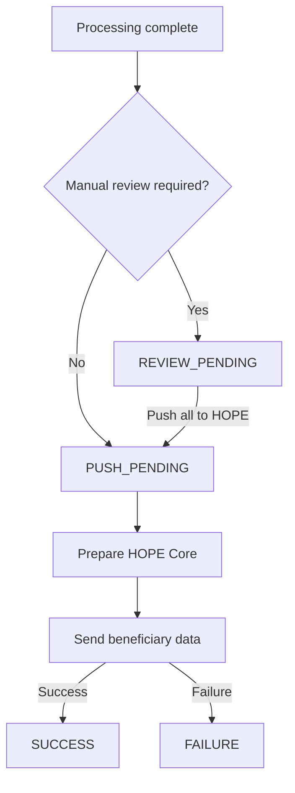

# Push to HOPE Core

Pushing an **[RDP](index.md)** transfers its beneficiary records from Country Workspace to HOPE Core as a Registration Data Import (RDI).

The push starts after the RDP finishes its required **[RDP operations](operations/index.md)** and does not require manual action when no review is needed.

## Start the push

When the RDP is ready to continue, Country Workspace changes its status to `PUSH_PENDING` and starts preparing HOPE Core for the push.

If the RDP is in `REVIEW_PENDING`, the user can choose **Push all to HOPE** to continue with all beneficiaries despite the review threshold being exceeded.

```mermaid
flowchart TD
    A[Processing complete] --> B{Manual review required?}
    B -->|No| C[PUSH_PENDING]
    B -->|Yes| D[REVIEW_PENDING]
    D -->|Push all to HOPE| C
    C --> E[Prepare HOPE Core]
    E --> F[Send beneficiary data]
    F -->|Success| G[SUCCESS]
    F -->|Failure| H[FAILURE]
```

See **[Lifecycle and statuses](lifecycle.md)** for the complete RDP state flow and **[Biometric deduplication](operations/deduplication.md#manual-review)** for biometric review decisions.

## Prepare HOPE Core

If the RDP is not linked to a previous HOPE RDI, Country Workspace can continue directly to the data push.

If a previous HOPE RDI exists, Country Workspace first requests an RDI reset. The RDP remains `PUSH_PENDING` while waiting for HOPE when necessary.

If the previous RDI no longer exists, processing continues with a new RDI. If HOPE reports that the previous RDI has already been merged, Country Workspace completes the RDP as `SUCCESS` without sending the beneficiary data again.

If HOPE reports that the previous RDI merge is still in progress, the push changes to `FAILURE` and can be retried later.

## Send beneficiary data

Before sending data, Country Workspace runs the RDP preflight checks again. If the checks fail, the push changes to `FAILURE`.

When the checks pass, Country Workspace creates a new RDI in HOPE Core, sends the beneficiary records, and completes the RDI.

For household-based Programs, Individuals are sent before Households. For people-only Programs, People are sent directly.

See **[Create an RDP](create.md#before-creating-an-rdp)** for the checks applied to RDP records.

## Retry a failed push

An RDP in `FAILURE` can be retried with **Retry push to HOPE**.

Retry starts a new push attempt and returns the RDP to `PUSH_PENDING`. If the RDP is linked to a previous HOPE RDI, Country Workspace performs the required RDI reset before sending the data again.

See **[Recover a stuck push](lifecycle.md#recover-a-stuck-push)** if an active push remains in `PUSH_PENDING` and can no longer continue.

## Collectors

When a selected Household references an Individual as Primary or Alternate Collector, Country Workspace includes that Individual in the push whether or not the collector is a Household member.

If several Households in the same RDP reference the same collector, that Individual is sent once. A collector included only through these references is not marked as removed after a successful push.

See **[External collectors](../data_import/sources/kobo.md#external-collectors)** for source-specific details.

## After a successful push

After a successful push, Country Workspace stores the HOPE RDI ID and changes the RDP to `SUCCESS`.

For household-based Programs, the selected Households and their members are marked as removed. For people-only Programs, the selected People are marked as removed.

For biometric RDPs, Country Workspace also attempts to approve the associated Deduplication Set in DedupEngine. An approval failure is recorded but does not change the RDP from `SUCCESS`.

See **[Biometric deduplication](operations/deduplication.md)** for biometric processing and **[Troubleshooting](troubleshooting.md)** if the push does not complete as expected.
